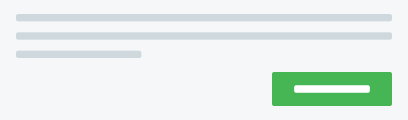

import { Stack } from "@kiwicom/orbit-components";

import Palette from "../../../components/Palette";

> Use color intentionally.
> It's not decoration.
> Color is supposed to be functional.

## General guidelines

We have different shades for every defined color in Orbit.
For most of our colors, the following points should apply:

Shades are an exception because they're usually used for general use cases like texts, headings, and borders.

- Every color has **specific guidelines** for meaning.
  We honor these guidelines in order to maintain consistency across the product.
- It's usually **safe to combine** the _Light_ and _Dark_ shades of any color.
  Text in the _Dark_ shade should be readable on the _Light_ background of its color.
- No _Dark_ shade should be used as a background.
- Every non-_Dark_ color has **two additional shades** defined:
  `:active` and `:hover`.
  These additional shades should **only** be used for **very specific** cases.
- All of our colors are also defined as [design tokens](/foundation/design-tokens/),
  so non-Orbit components can use Orbit colors directly
  and they don't need to define colors again in their local codebase.

### Background & foreground colors

We use two main colors for backgrounds:

<Stack direction="row" spacing="medium">
  <InlineToken name="paletteWhite" size="large" alternateName />
  <InlineToken name="paletteCloudLight" size="large" alternateName />
</Stack>

And four colors to create status backgrounds:

<Stack direction="row" spacing="medium">
  <InlineToken name="paletteBlueLight" size="large" alternateName />
  <InlineToken name="paletteGreenLight" size="large" alternateName />
  <InlineToken name="paletteOrangeLight" size="large" alternateName />
  <InlineToken name="paletteRedLight" size="large" alternateName />
</Stack>

These are mostly used for backgrounds for any elevation level or component.
These colors are accessible with dark foreground colors,
so we recommended using **Light** shades for **backgrounds** and **Dark** shades for **foregrounds**.
You can also use complementary and minor colors from our palette,
which should give you enough colors to work with.

### Interactive colors

Interactive colors are used in components with some indication of state
that do **not** move you forward in the flow or redirect you to another page.
All of these elements should be colored in <InlineToken name="paletteBlueNormal" alternateName />.
This mostly means _hover, focus, select, active, press_, and _drag_ states.

### Actionable colors

Actionable colors are used in components that include an action (such as moving you forward in the flow).
This means the [Button](/components/action/button/), [ButtonLink](/components/action/buttonlink/), and [TextLink](/components/action/textlink/) components.
For the actionable color, we use our main **<InlineToken name="paletteProductNormal" alternateName/>**.
Elements that aren't actionable shouldn't be in this color.

## Orbit palette

The color palette contains every one of the colors we use in our designs.
These colors are also used by default in white label solutions for our partners
and can be modified to their brand colors (see [more about theming](/foundation/color/theming/)).

<Callout title="The reasoning behind the additional shades">
  As you might have noticed, our basic color palette is quite simple---just a few shades. If you
  need multiple layers for the UI, you can use the additional shades. Using just the basic shades
  would make the UI heavy. Use the additional shades to make the UI more layered and subtle. They're
  also useful for specific interaction states, such as hovering and focusing. Do **_not_** use these
  addition shades alone. Use the basic shade as the primary color and only use the additional shades
  when needed to create more depth or interactions.
</Callout>

### Product

<Palette
  allowAdditional
  colors={[
    "paletteProductLight",
    "paletteProductNormal",
    "paletteProductDark",
    "paletteProductDarker",
  ]}
/>

<Callout type="warning">
  We're aware of a slight contrast issue with our Product Normal color and the issues when using it
  for Primary buttons. We're exploring possible solutions. We highly recommend against using it for
  text and we recommend using darker shades when possible.
</Callout>

#### Product guidelines

<Guideline type="do" title="Use Product Normal for primary actions">

When used only for primary actions on buttons or text links,
the actions tend to stand out from the interface.

</Guideline>

<Guideline type="dont" title="Don't use Product color to highlight information">
Using Product colors for actions may cause confusion
if the color is used for something like highlighting information or text.

Bigger font sizes and heavier font weights help highlight.
See [typography](/foundation/typography/) for more.

</Guideline>

<Guideline type="dont" title="Don't use any Product color for the focus state of form elements">
When your Product color is green-ish or red-ish,
it may be easily confused with success or error states.

This is exactly what [Orbit Blue](#blue) was designed for.

</Guideline>

<Guideline type="dont" title="Don't use Product colors for backgrounds">
It can interfere with the visual priorities on the page and draw attention to non-action elements.
Generally, buttons should be the only elements with dark backgrounds.
Nothing on the page should draw attention away from them.

To try to keep the UI light as possible, use only Cloud colors or Light shades for backgrounds.

</Guideline>

### White

<Palette allowAdditional colors={["paletteWhite"]} />

#### White guidelines

<Guideline type="do" title="Use White as the background for content">
This allows important information to appear on the page without interference.

</Guideline>

<Guideline type="do" title="Use White as the background for inputs">

But make an exception for mobile apps.
There, follow best practices and use gray for input backgrounds.

</Guideline>

### Cloud

<Palette
  allowAdditional
  colors={["paletteCloudLight", "paletteCloudNormal", "paletteCloudDark", "paletteCloudDarker"]}
/>

#### Cloud guidelines

_Cloud_ colors are generally used for backgrounds or borders.

<Guideline type="do" title="Use Cloud Light for the page background">

Then the page doesn't blind users with bright white
and it works well with white Cards and sections for content.

</Guideline>

<Guideline type="dont" title="Don't use Cloud Normal as the border for inputs">
If an input is used on a non-white background, the border isn't be visible.

Use <InlineToken name="borderColorInput" /> instead.

</Guideline>

#### Cloud exceptions

- It's possible to use _Cloud_ colors as backgrounds for inputs in mobile apps,
  where it's a common pattern.

### Ink

<Palette allowAdditional colors={["paletteInkLighter", "paletteInkLight", "paletteInkNormal"]} />

For more information about usage, see [Typography](/foundation/typography/) and [Icons](/foundation/icons/).

#### Ink guidelines

_Ink_ colors are generally used for typography and icons.

<Guideline type="do" title="Use Ink Normal as the main text color">
Even better, rely on the value of <InlineToken name ="colorTextPrimary" />
as it properly supports theming.

</Guideline>

<Guideline type="dont" title="Don't use any Ink color for backgrounds">
We like our interface light and this would really mess with visual priorities.

</Guideline>

### Status colors

#### Green

<Palette allowAdditional colors={["paletteGreenLight", "paletteGreenNormal", "paletteGreenDark"]} />

##### Green guidelines

<Guideline type="do" title="Use Green to communicate success">
We have several components in Orbit that do this---[Alert](/components/information/alert/),
[Badge](/components/information/badge/), and [Text](/components/text/text/) all have a success type.

</Guideline>

<Guideline type="dont" title="Don't use Green for next buttons">
You should use primary buttons for every important action,
and secondary buttons for less important actions.

Only use success buttons if you need actions in a success alert.

</Guideline>

#### Orange

<Palette
  allowAdditional
  colors={["paletteOrangeLight", "paletteOrangeNormal", "paletteOrangeDark"]}
/>

##### Orange guidelines

<Guideline type="do" title="Use Orange for warning states">

We have several components in Orbit that do this---[Alert](/components/information/alert/),
[Badge](/components/information/badge/), and [Text](/components/text/text/) all have a warning type.
Be sure that you explain clearly what you're warning users about.

</Guideline>

<Guideline type="dont" title="Don't use Orange to highlight information">
Users may misunderstand the message as an error.

If you really need to highlight something with color, use [Blue](#blue).

</Guideline>

#### Red

<Palette allowAdditional colors={["paletteRedLight", "paletteRedNormal", "paletteRedDark"]} />

##### Red guidelines

<Guideline type="do" title="Use Red for critical states">
It's great for error states, showing negative information,
and informing users about critical states of their actions.

</Guideline>

<Guideline type="do" title="Use Red for destructive actions">
It communicates that something important and negative will happen when triggered.

</Guideline>

#### Blue

<Palette allowAdditional colors={["paletteBlueLight", "paletteBlueNormal", "paletteBlueDark"]} />

##### Blue guidelines

<Guideline type="do" title="Use Blue Normal for focus in forms">
Orbit uses Blue for focus states of inputs, buttons, and other form elements.

</Guideline>

<Guideline type="do" title="Use Blue Normal for active or selected states">
Orbit uses Blue in all selected states for checkboxes and radios, active tabs,
and components like ChoiceTile that allow users to pick something.

</Guideline>

<Guideline type="dont" title="Don't use Blue for links or primary buttons">
Even though blue is commonly used for links across the internet,
Orbit uses Product Normal for such elements.

</Guideline>

### Social color palette

<Palette allowAdditional colors={["paletteSocialFacebook"]} />

#### Social guidelines

<Guideline type="do" title="Use the Facebook color only for Facebook-related content">
That basically means that we use the Facebook color only for [Facebook login buttons](/components/action/socialbutton/).

</Guideline>

#### Google

There aren't any specific colors for Google.
We just use the colored version of their logo and <InlineToken name="colorTextPrimary" /> for text.
