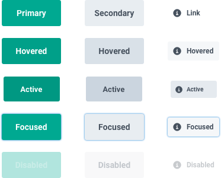

import ButtonSizeSnippet from "snippets/button-size.mdx";

<ReactExample exampleId="Button-default" />

## When to use

If you're unsure what component or type to use for actions,
check out our [interactive guide on action components](/guides/using-button-type-components/).

- To offer the most important actions users can take.

### When not to use

- When you have many actions at once---use a [button link](/components/action/buttonlink/).
- You want to offer a less important action---use a [button link](/components/action/buttonlink/).
- To make text inside paragraphs or lists actionable---use a [text link](/components/action/textlink/).
- So users can sign in using a social service---use a [SocialButton](/components/action/socialbutton/).

## Component status

<ComponentStatus component="Button" />

## Content structure

<FigmaFile
  file="4QJZqvBvRrLu6t9mwObCkA"
  node="289%3A14"
  alt="IconLeft: visually supports button visability; label: describes the main action and works best when short; icon right: shows additional options for the button (expandable, link, etc.)."
/>

## Behavior

### Identify the most important actions

> "If everything looks important, then nothing is important."
>
> ---Patrick Lencioni

Users need to be certain of what action to take next.
You need to know which actions are the most important within a given section of the user flow.

Once you've identified which actions are the most important at the moment,
you can indicate importance through [size, type, and variation](#look--feel).

<Guideline type="do" title="Have one primary action">

Every screen should have only one button that represents the most important action.
It leads the user to the next step.

<FigmaFile
  alt="One primary button on a screen stands out."
  file="fannvRpkOJK6uxxT33EKaa"
  node="10%3A1406"
/>
<FigmaFile
  alt="Too many primary buttons confuse users."
  file="fannvRpkOJK6uxxT33EKaa"
  node="10%3A1666"
/>

</Guideline>

<Guideline type="do" title="Show importance hierarchy">

If you have multiple actions on one screen,
use different button types and sizes to show different levels of importance.

<FigmaFile
  alt="One primary button on a screen stands out."
  file="fannvRpkOJK6uxxT33EKaa"
  node="10%3A1406"
/>

</Guideline>

### Avoid disabled buttons

Many designers want to show users that actions will be possible in the future,
so they end up using disabled buttons to show potential actions.
But such buttons often end up confusing users about what's possible.

Instead, try to focus on using [progressive disclosure](/design-patterns/progressive-disclosure/)
to show them only the actions they should take right at the moment.
Then when it's possible for them to take action, you can show them more buttons.

If you need to use a disabled button,
always make it clear how users can activate it,
such as with a [tooltip](/components/overlay/tooltip/).

## Content

### Use actionable text

It should be clear from the button text exactly what will happen
when the user interacts with it.
The labels should be actionable, such as "Add passenger" and "Book for (price)".

Avoid long explanations in the button text.
The text should be short and clear.
If additional explanation is needed, add it above the button as text.

See [examples for how to make actions clear](/kiwi-use/content/voice-and-tone/straightforward/#make-every-action-clear).

## Look & feel

<ButtonSizeSnippet />

### Button types

Buttons come in **three sizes** (large, normal, and small)
and **three types** (primary, secondary, and critical).
Two of these types (primary and critical) also have **subtle** versions in lighter shades
to show actions that don't draw as much attention.

Primary buttons are best for the [single primary action](#identify-the-most-important-actions) on the screen.
Critical buttons work for destructive actions---actions users can't take back.
All remaining actions can be secondary buttons or [another component](#when-to-use).

<ReactExample exampleId="Button-types" />

<Guideline type="do" title="Use secondary small buttons for additional actions on the page">

The secondary small button is great for actions in [cards](/components/structure/card/)
as it stands out from the interface but doesn't take so much attention.

</Guideline>

<Guideline type="do" title="Use secondary buttons for items in loop">

If you have a repeated view,
use the secondary button for their main action.
Primary buttons would offer too many choices to select from.

</Guideline>

<Guideline type="do" title="Don't use primary buttons to manipulate users">

If there are more choices on one level (and it's an essential step in the flow),
all buttons should be primary.

Making one primary and the other secondary would be manipulating the user towards our preferred choice.

</Guideline>

### Buttons with icons

Buttons with icons are great when you need to draw more attention to the action.
Icons add additional context and makes the buttons more easy to scan.

But it's essential to not overuse these buttons.
If everything is grabbing attention, things usually get messy.

<ReactExample exampleId="Button-icons" />

<Guideline type="do" title="Use a left icon when the button adds another item">

For cases like this, it's great to use an icon with a plus to represent the addition,
such as PlusCircle or PassengerAdd.

</Guideline>

<Guideline type="do" title="Right icons should only be directional">

They can help explain what happens when the user interacts with the button.
An icon (with an aria-label) makes it easier to know if the user is taken elsewhere.

</Guideline>

<Guideline type="do" title="Add a label when using icon-only buttons">

Even the simplest icons like plus can be understood in many different ways.
To make sure your icon is accessible,
add a proper label to communicate the purpose.

</Guideline>

### Button states

All of our buttons use a consistently defined set of states.

- **Hover** -- We change the background of a button to its :_hover_ color.
- **Active** -- We scale down the button with the <InlineToken value="modifierScaleButtonActive" />
  design token and also change the background to its _:active_ color.
- **Focus** -- The background stays same but we create a light blue border around the button.
- **Disabled** -- We change the button opacity with the <InlineToken value="opacityButtonDisabled" />
  design token. This deactivates all the states listed above.
