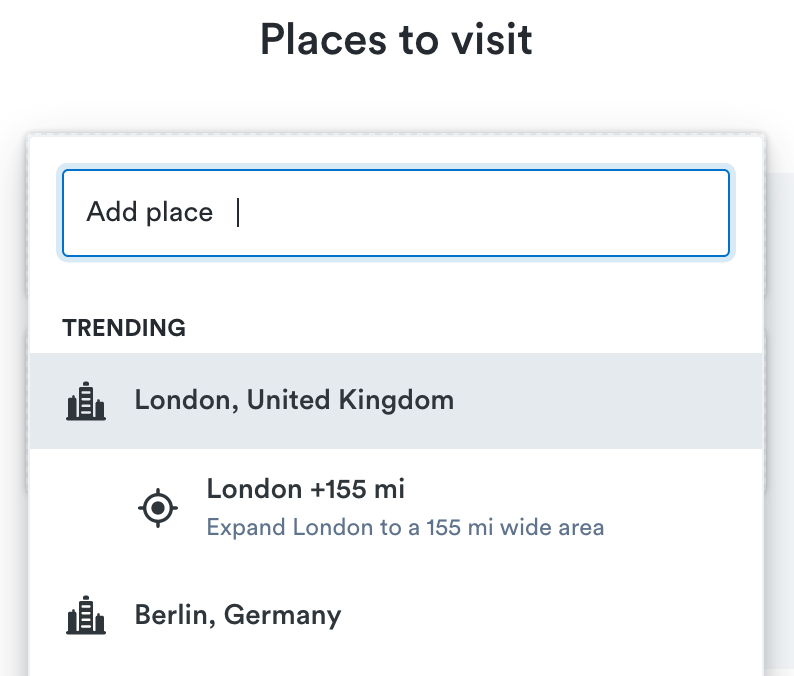
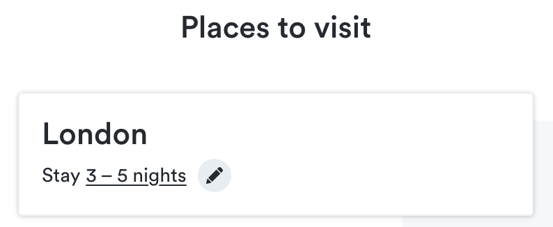
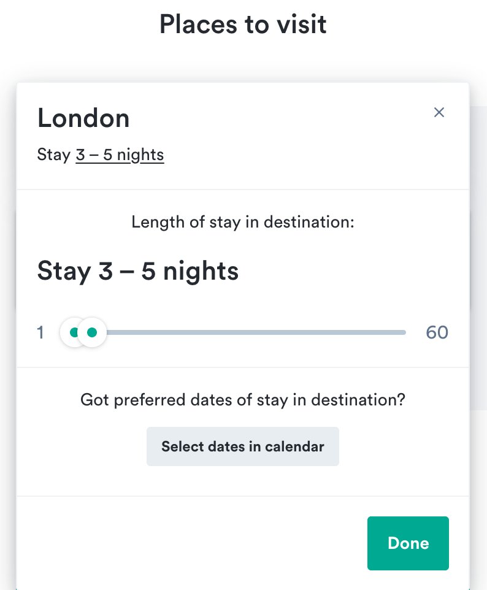

Users come to your designs with competing desires.
They want to be able to do a lot (**features**)
but they don't want to spend time learning how to do it (**simplicity**).
How can you give them everything without overwhelming them?

The answer is progressive disclosure.
By following this principle,
you show users **only what they need at a given time** to make a decision
and keep everything else a tap away.
This means deciding what the most important options are in a given flow
and making it clear to users how they can get to other options.

Read [more about progressive disclosure](#what-progressive-disclosure-means-for-you),
see some [examples of how we implement it in Orbit](#examples),
and explore [what components you can use](#how-to-use-with-orbit) in your own designs.

## What progressive disclosure means for you

Progressive disclosure is a way to manage the vast amount of information you have available.
If you try to present all possible choices to users at once,
it's difficult for them to choose what's important and what isn't.
This leads to them getting **overwhelmed** by information
(known as [information overload](https://en.wikipedia.org/wiki/Information_overload))
and increases the chance that **they don't do anything**.

<FigmaFile
  file="uK3xATJqPZwNwV5KT7igBG"
  node="3%3A5"
  alt="A long page with buttons in 3 different configurations: 1. everything primary, 2. one primary and the rest secondary, 3. everything secondary."
  caption="On the left, we can see that when everything is important, nothing is. To fix this, either highlight the one most important action (the middle option) or make them all less distinct (the option on the right)."
/>

To help users through this,
you want to **simplify** your designs to highlight what's important.
It's important to remember to make it clear
that the secondary choices are still available
and how users can get to them if they want.

The idea of user desire is important because you don't want
users to think they can't do something that they actually can.
You want to make sure they don't leave in search of another solution
to do something they can achieve with your design.

### How to choose what's most important

When you're thinking about what should be displayed by default,
you want to consider several questions.
The answers should help you decide what should be displayed by default
and what can be progressively disclosed over time.

- What's the user's primary goal **at this moment**?
  - Here, it's not just about the overall goal
    (such as booking a flight within a budget),
    but the goal on a given screen (such as choosing a date).
- Is there any information that users would need to know **some** of the time,
  but **not always**?
  - Are there any advanced options that fit certain scenarios,
    but aren't likely to be used by everyone?
- If all of the information were displayed
  and users could **choose to hide** some of it,
  what would many of them choose?
  - User testing could come in handy to determine what people find unnecessary.
- Is any of the information **additional explanation** of something already present?
  - If something is present,
    it's a good candidate for an interaction that can show more details.

When you've come up with answers to such questions,
choose only the important information and display it clearly.
Then organize everything else so that users can clearly see how to access it if they want.

## Examples

There are many places in Orbit where we have progressive disclosure baked into the components.
We've designed them so that they progressively disclose information
without you having to set it up.

### Slider

You can see one example if you move the handler in the [slider](/components/interaction/slider/) below.

<ReactExample exampleId="Slider" />

At first sight, you can see the range that's being selected,
but it's only after interacting with the slider that you see more details in the histogram.

### Error forms

We also have more complex patterns that follow this principle,
such as how we deal with errors in forms.

### Nomad

You can see another example of this practice
in the process of adding destinations in [Nomad](https://www.kiwi.com/nomad),
a Kiwi.com tool for exploring the world with a flexible itinerary.
When you first try to add a place, all you see is a list of potential destinations.

Your choices are limited to the primary option: the place.
Once you have chosen a place, it's added to your list along with a standard length to stay.
This length is highlighted in the UI as a place where there are additional options.

If you select this, you see additional options for the length of stay.

Even here, there is only one primary action:
a slider to choose a length of stay.

People who have more specific desires
(who might not be the primary audience for Nomad, but who might also use it)
can use a secondary button to open even more advanced options for choosing dates.
The path to get additional choices is clear,
but each step along the way presents only a single main action so users know what to focus on.

## How to use with Orbit

Orbit gives you several options for implementing this principle
in addition to the components where it's already in place,
like the [slider example above](#slider).

### Truncate

[Truncate components](/components/utility/truncate/) make long text fit within a given space.
The text is present on the page, but hidden by default.
This lets you show various amounts of text based on user actions or at various sizes,
as in the example below.

<ReactExample exampleId="Truncate" />

### Collapse

[Collapse components](/components/interaction/collapse/) hide long information
so that it's not cluttering up the screen.
They're great for hiding things like
options that have reasonable defaults that most people wouldn't change,
but some people might want to.
This is especially true where there are multiple groups of such options.

The example below could be used to hide options for filtering a search
where most people would want to get to their destination in any way possible,
but some people only want certain options.

<ReactExample exampleId="Collapse search filter" />

### Popover

[Popovers](/components/overlay/popover/) help reduce clutter in your designs
by keeping small bits of information hidden behind an interaction.
They work well for units of slightly complex options
(if it gets to be very complicated, consider a [modal](/components/overlay/modal/) to structure it all).

The example below shows a button displaying the current number of selected passengers.
When it's clicked, additional options for adding or removing passengers can be seen.
This is an action that wouldn't happen repeatedly during a flow,
so it's best to hide it when it's not being used.

<ReactExample exampleId="Popover passengers" />

### Tooltip

[Tooltips](/components/overlay/tooltip/) highlight text
to show that there is additional context available behind the text.
They're a basic way of keeping information present but hidden.

You can see an example in the [pricing table](/components/structure/pricingtable/) below.
The features are presented simply for comparison,
but each has a tooltip for explaining additional details.
This can separate more complex information, like lists.

<ReactExample exampleId="PricingTable-progressive_disclosure" />

### CardSection

[Cards](/components/structure/card/) are great at grouping together static content,
like long complex information.
When that information gets longer or has chunks that are similar,
you can hide details using expandable card sections.
That way the structure of the information remains clear,
but users aren't overwhelmed by details.

The example below shows how you could group passenger details with a card.
The most important information can be shown as the section title,
so people can see the names at a glance,
and then anything else is just a quick expand away.

<ReactExample exampleId="Card-expand_uncontrolled" />]
