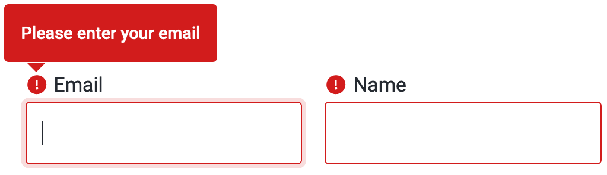

Even when you’ve [designed the perfect form](/design-patterns/designing-forms),
users sometimes run into issues when filling them in.

Users see error messages as barriers to a goal they want to achieve.
Too many barriers or barriers with no clear solutions means they give up on the goal.
That’s why Orbit supports [progressive disclosure](/design-patterns/progressive-disclosure) with input errors,
showing the least info possible at one time to get through each step.

Understand [how users experience a form](#how-users-experience-guidance)
in order to then [design the most effective forms](#designing-easy-to-complete-forms).

## How users experience guidance

To keep users from getting overwhelmed and abandoning forms,
they see guidance progressively as they go through the form.
How do they see that?

### Help

When a user first interacts with a form element,
they’ll see any help you have added as tooltips pointing to the label of that field.
This can help them get started on complicated fields.

Users can close the help once they’ve understood it.
Note that help isn't displayed if an error is present.

<ReactExample exampleId="InputField-help" />

### Required fields

Required fields in a form are automatically marked with a red asterisk
to show that users must fill something in.

<ReactExample exampleId="InputField-required" />

### Inline validation

As the user goes through the form, they may focus on one field after another.
If they, say, focus on an email field and then focus on another field
without completing their email correctly (leaving a required field blank or some other error),
the email field is marked as an error.

To show the error, the field is highlighted in red
and (if it has a label) given an error icon to show the error
(using both ensures we [use more than just color]()).
The icon appears only with labels, which is another reason to always include a label with your fields.

If the user returns to focus on that field or hovers over the icon,
a tooltip appears pointing at the icon (or field, if there’s no icon)
with a message to guide them to completion.
The error overrides any help that was displayed
and disappears after the user returns to the field and fixes the error.

<ReactExample exampleId="InputField-error" />

### Form submission validation

If a user misses errors created while navigating through the form
(or never focuses on a field to produce the error),
the form is also validated on submission.
This validation highlights all fields with errors (again in red and with an icon).

To help users complete all fields correctly,
the best behavior is to automatically scroll to the first field with an error and focus on it.
This focus makes the error message for that field, and only that field, appear as a tooltip.

As the user focuses on other fields, each has its error message shown only on focus.

## Designing easy-to-complete forms

### Add help when necessary

Adding guidance in the form of help tooltips can help users know what to do.
Keep in mind that if there are a lot of tooltips,
they may overwhelm users with too much information.
Only use them when they add value (not for understandable and unformatted fields like names).

### Match visuals and requirements

Visual constraints help reinforce the required format while reducing the need for guidance.
For example, make Day and Year fields shorter than Name fields as they require fewer characters.

### Make selection clearer

Use month names (January, February, and so on) instead of numbers.
Usability testing has shown this can prevent errors before they start.

### Write helpful error messages

Tell the user exactly **what** the problem is, **how to fix** it,
and possible **further actions** (if the context allows).

Be **polite**.
Focus on a solution and not on blaming the user or apologizing for the problem.

<GuidelinesSideBySide>

<Do>

- Name is required
- Flight not found. Try entering again.

</Do>

<Dont>

- You didn't enter your name
- We're very sorry but we couldn't find that flight. Please try to enter the number again.

</Dont>

</GuidelinesSideBySide>

**Clarity is key**.
Users see errors as barriers so they’re not the right place for jargon, humor, or personality.

<GuidelinesSideBySide>

<Do>

- Email not in the proper format
- Password must contain at least one number

</Do>

<Dont>

- Your email is too fancy for words
- Your secrets are safe with us as long as you give us a number

</Dont>

</GuidelinesSideBySide>

Keep it **short**.

<GuidelinesSideBySide>

<Do>

- Expiration must be in the future
- Improper format for ID number

</Do>

<Dont>

- The date when your passport expires must take place at some point in the future
- The data you entered for your ID number contains some characters that shouldn't be there

</Dont>

</GuidelinesSideBySide>

## Affected components

These components follow the pattern described above:

- [InputField](/components/input/inputfield/)
- [InputFile](/components/input/inputfile/) (also highlights text inside input)
- [InputGroup](/components/input/inputgroup/) (highlights the entire group if any member has an error)
- [InputStepper](/components/input/inputstepper/)
- [Select](/components/input/select/) (shows error message on opening)
- [Textarea](/components/input/textarea/)

These components have different use cases and so use a different pattern:

- [Checkbox](/components/input/checkbox/):
  errors only highlight the box to be checked if it’s not selected.
- [ChoiceGroup](/components/input/choicegroup/):
  error messages appear below the group.

## Design decisions

The design patterns listed above were subjected to user testing to ensure they work in practice.
If you’re interested in why the pattern appears as it does, read on.

### Why a tooltip?

We needed to support longer messages
(in multiple languages, including ones where it can get more complicated).
Previously, we showed error messages below each field, but this limited us in several cases:

- Longer messages needed to be shortened
  as otherwise they would break the form grid layout and the fields wouldn’t be aligned.
- Shorter form fields (like Day or Year) didn’t have enough space below the field
  to show more than a few letters.

Tooltips give more options for the content itself
and can be used more effectively in explaining what users should do to overcome each error.

### Tooltip positioning

We experimented with having the tooltip at the bottom of the field,
but it wasn’t connected with the error icon itself,
which caused issues when showing the tooltip on hover
(the tooltip pointed to a different place than the hovered element).
The top position is also more suitable for components that expand to the bottom,
specifically [Select](/components/input/select/) and [Textarea](/components/input/textarea/).

### Color and borders

Our default focus for form elements is <InlineToken name="paletteBlueNormal" alternateName/>.
We use a 1 px border and a 3 px outline with opacity,
which should draw attention to the focused element.
For errors, we use the same structure for the focused element,
but instead of blue it’s <InlineToken name="paletteRedNormal" alternateName/>.
Buttons are always focused with a 3 px outline with opacity in the color equal to the background.
For block actionable elements,
we use <InlineToken name="paletteCloudNormal" alternateName/> for the background.
