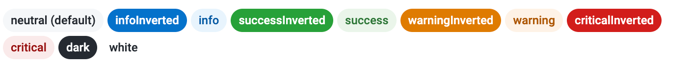
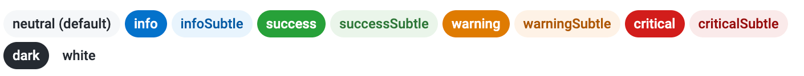
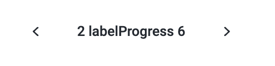
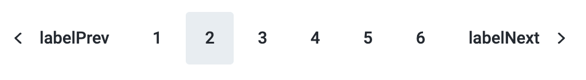
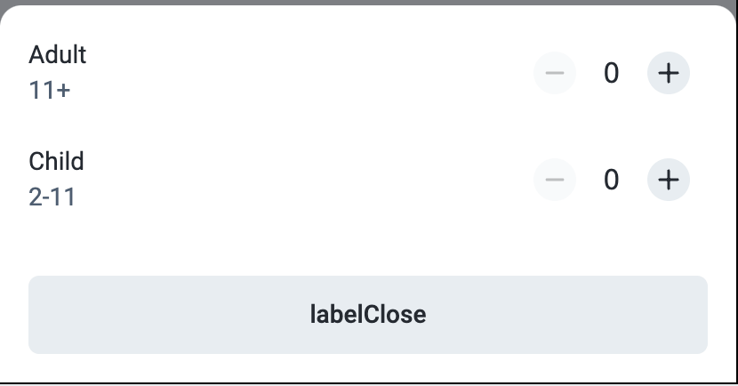
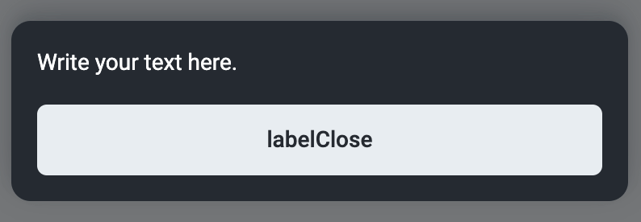
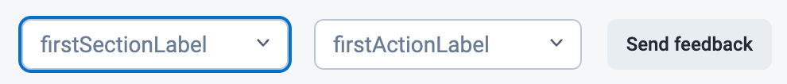
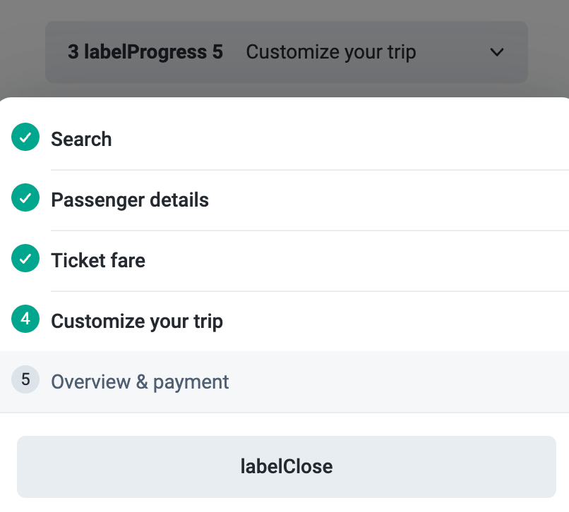

# Orbit Migration Guide v7

This migration guide focuses on the process of migrating from Orbit v6.4 to v7.0, as some breaking changes were introduced.
With this guide, we aim to walk through all the breaking changes and how they can be addressed, allowing the migration to be smoother and effortlessly.

## Breaking changes

### Toast

The `createToastPromise` function now receives three arguments. The first argument is the promise. The second one is an object with the different possible states (`loading`, `success` or `error`) and their corresponding messages. The third one is optional and controls the icon that is displayed on the toast of each state (or all).
In fact, the icon property was not working at all in the past. The breaking change was introduced to allow the icon to work.
_If no icon was intended to be displayed in the past, this change is actually not a breaking change, as the third argument is optional and the function will work just the same with just two arguments._

**Before:**

```jsx
createPromiseToast(promise, {
  icon: <Notification />,
  loading: "...Loading",
  success: "Got the data",
  error: "Error when fetching",
});
```

**Now:**

```jsx
// This will display the icon Notification on the success toast
createPromiseToast(
  promise,
  {
    loading: "...Loading",
    success: "Got the data",
    error: "Error when fetching",
  },
  {
    success: {
      icon: <Notification />,
    },
  },
);

// This will display the icon Notification on all toasts
createPromiseToast(
  promise,
  {
    loading: "...Loading",
    success: "Got the data",
    error: "Error when fetching",
  },
  {
    icon: <Notification />,
  },
);
```

### BadgePrimitive

The `borderColor` prop was removed. The badge is no longer expected to have any border. No action is required, but the prop won't have any effect if it is still used.

### Badge

The values accepted by the `type` prop have changed. The previous `-Inverted` variant of a color is now the default variant of the same color. The previous default variant of one color is now the `-Subtle` variant of the same color.

**Before**



```jsx
<Badge type="neutral">neutral (default)</Badge>
<Badge type="infoInverted">infoInverted</Badge>
<Badge type="info">info</Badge>
<Badge type="successInverted">success</Badge>
<Badge type="success">success</Badge>
<Badge type="warningInverted">warning</Badge>
<Badge type="warning">warning</Badge>
<Badge type="criticalInverted">critical</Badge>
<Badge type="critical">critical</Badge>
<Badge type="dark">dark</Badge>
<Badge type="white">white</Badge>
```

**Now**



```jsx
<Badge type="neutral">neutral (default)</Badge>
<Badge type="info">info</Badge>
<Badge type="infoSubtle">infoSubtle</Badge>
<Badge type="success">success</Badge>
<Badge type="successSubtle">successSubtle</Badge>
<Badge type="warning">warning</Badge>
<Badge type="warningSubtle">warningSubtle</Badge>
<Badge type="critical">critical</Badge>
<Badge type="criticalSubtle">criticalSubtle</Badge>
<Badge type="dark">dark</Badge>
<Badge type="white">white</Badge>
```

### ModalFooter

On devices bigger than `largeMobile`, the property `flex: none` was applied. A wrapper may now be needed in some usages.

**Before**

```jsx
<ModalFooter flex={flex}>
  <Button fullWidth>Continue to Payment</Button>
</ModalFooter>
```

**Now**

```jsx
<ModalFooter flex={flex}>
  <Box justify="end" display="flex">
    <Button>Continue to Payment</Button>
  </Box>
</ModalFooter>
```

### InputField

The `size` prop was removed. The previous `size="normal"` size is now the only one available.

### Select

The `size` prop was removed. The previous `size="normal"` size is now the only one available.

### Tokens

Some tokens were removed: `marginButtonIconSmall`, `marginButtonIconNormal` and `marginButtonIconLarge`. They were all replaced by a new single token (`marginButtonIcon`), with a single value, since it is no longer expected to change with the button size.

### Translations

Orbit no longer maintains any dictionary nor translations. This means that components that were providing translated strings will now require those strings to be provided and translated on the app side.
Components `Translate` and `Dictionary` were removed, as well as the hooks `useTranslate` and `useDictionary`. The `OrbitProvider` component no longer accepts the `dictionary` prop.
Codemods are available and should automate the affected components to use the correct translation keys. There are two codemods available: one using the `Translate` component from `nitro` and other that uses the `react-intl` library for translations.

The following components were affected:

#### Pagination

New props were added: `labelPrev`, `labelNext` and `labelProgress`. They are all required and expect the translated labels for the previous and next buttons, as well as the label that presents the progress of the pages.




#### Popover

New prop added: `labelClose`. It expects the translated value of the button used to close the Popover on mobile. It has a default value for English (`"Close"`).



#### Tooltip

New prop added: `labelClose`. It expects the translated value of the button used to close the Tooltip on mobile. It has a default value for English (`"Close"`).



#### MobileDialogPrimitive

New prop added: `labelClose`. It is required and expects the translated value of the button used to close the MobileDialogPrimitive. It has a default value for English (`"Close"`).


#### SkipNavigation

New props were added: `firstSectionLabel`, `firstActionLabel` and `feedbackLabel`. They expect the translated values of the texts on the select elements and button. They have default values for English (`"Jump to section"`, `"Common actions"` and `"Send feedback"`, respectively).



#### Drawer

New prop added: `labelHide`. It expects the translated value of the `title` attribute that is present on the close button of the Drawer. It has a default value for English (`"Hide"`).

#### Alert

New prop added: `labelClose`. It expects the translated value of the `title` attribute that is present on the close button, when the Alert is closable.

#### Card

New prop added: `labelClose`. It expects the translated value of the `title` attribute that is present on the close button, when the Card is closable. It has a default value for English (`"Close"`).

#### Modal

New prop added: `labelClose`. It expects the translated value of the `title` attribute that is present on the close button of the Modal. It has a default value for English (`"Close"`).

#### Breadcrumbs

The `goBackTitle` now accepts a `ReactNode` element. It expects the translated value for the `Back` button that is displayed on smaller viewports. It has a default value for English (`"Back"`).

#### NavigationBar

New prop added: `openTitle`. It expects the translated value of the `title` attribute that is present on the open menu button of the NavigationBar, placed on the right. It has a default value for English (`"Open navigation menu"`).

#### Wizard

New props were added: `labelClose` and `labelProgress`. They expect the translated labels for the previous and next buttons, as well as the label that presents the progress of the pages. `labelClose` has a default value for English (`"Close"`).



## Deprecated

### Card

The `icon` prop is now deprecated. If needed, the icon can still be used, but it should be part of the content of the card (part of the `children` prop).
