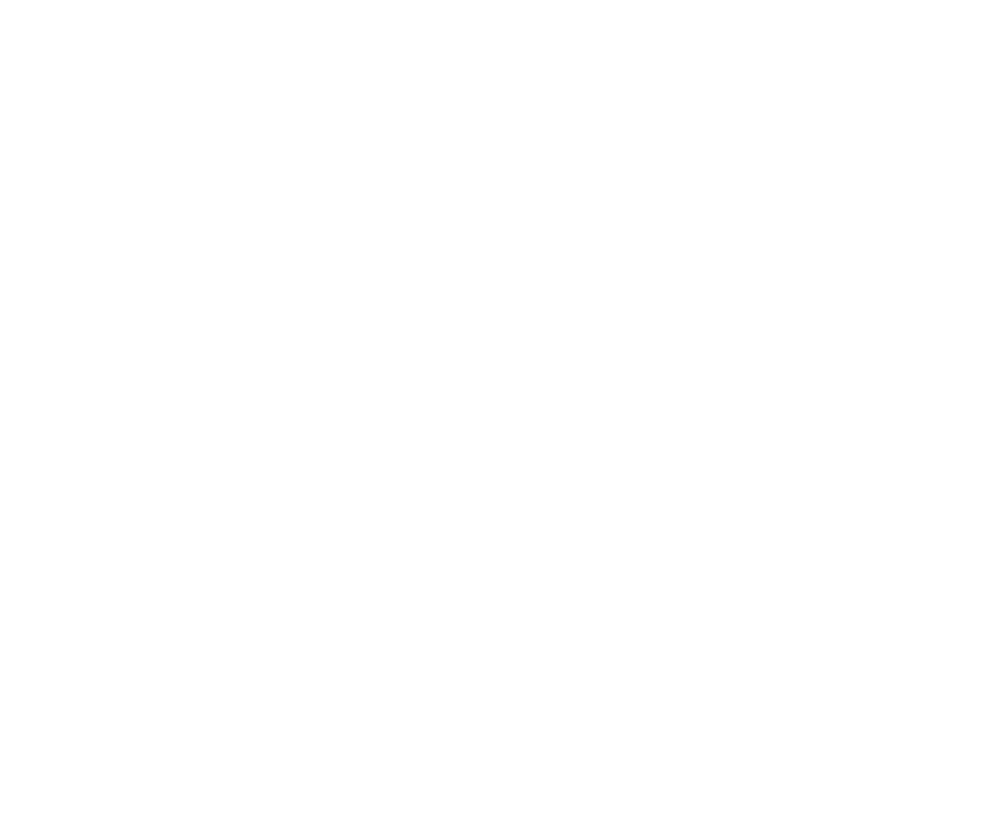

## Logo

### Basic logo

This is the preferred application on a light background.

<FancyLink icon="download" download>

[Download the full basic logo as .png](/brand/logo.png)

</FancyLink>

<FancyLink icon="download" download>

[Download the full basic logo as .pdf](/brand/logo.pdf)

</FancyLink>

<FancyLink icon="download" download>

[Download the full basic logo as .svg](/brand/logo.svg)

</FancyLink>

<FancyLink icon="download" download>

[Download the full basic logo as .eps](/brand/logo.eps)

</FancyLink>

### Logo symbol

<FancyLink icon="download" download>

[Download the logo symbol as .png](/brand/logo-symbol.png)

</FancyLink>

<FancyLink icon="download" download>

[Download the logo symbol as .pdf](/brand/logo-symbol.pdf)

</FancyLink>

<FancyLink icon="download" download>

[Download the logo symbol as .svg](/brand/logo-symbol.svg)

</FancyLink>

<FancyLink icon="download" download>

[Download the logo symbol as .eps](/brand/logo-symbol.eps)

</FancyLink>

### Reversed logo

<FancyLink icon="download" download>

[Download the reversed logo as .png](/brand/logo-reversed.png)

</FancyLink>

<FancyLink icon="download" download>

[Download the reversed logo as .pdf](/brand/logo-reversed.pdf)

</FancyLink>

<FancyLink icon="download" download>

[Download the reversed logo as .svg](/brand/logo-reversed.svg)

</FancyLink>

<FancyLink icon="download" download>

[Download the reversed logo as .eps](/brand/logo-reversed.eps)

</FancyLink>

### Reversed logo symbol

<FancyLink icon="download" download>

[Download the reversed logo symbol as .png](/brand/logo-symbol-reversed.png)

</FancyLink>

<FancyLink icon="download" download>

[Download the reversed logo symbol as .pdf](/brand/logo-symbol-reversed.pdf)

</FancyLink>

<FancyLink icon="download" download>

[Download the reversed logo symbol as .svg](/brand/logo-symbol-reversed.svg)

</FancyLink>

<FancyLink icon="download" download>

[Download the reversed logo symbol as .eps](/brand/logo-symbol-reversed.eps)

</FancyLink>

### Logo spacing

The logo is designed to be simple and graphically clean. So please, let
it breathe.

### Logo size

Logos used online should be at least 24 pixels high.

The minimum size for the offline use of the Kiwi.com logo is 18 × 9 mm.

## Favicons

<FancyLink icon="download" download>

[Download the Kiwi.com favicons](/brand/favicons.zip)

</FancyLink>

## Brand color

These are the basic palette colors.
See [more about using color](https://orbit.kiwi/foundation/color/)
including the entire Orbit palette, guidelines on color use,
and how the Orbit [design tokens](https://orbit.kiwi/design-tokens/)
enable synchronization of any color changes.

#### Product color

<Palette colors={["paletteProductNormal", "paletteProductDark"]} />

#### Cloud

<Palette colors={["paletteCloudNormal", "paletteCloudDark"]} />

#### Ink

<Palette colors={["paletteInkLight", "paletteInkNormal"]} />

#### Green

<Palette colors={["paletteGreenNormal"]} />

#### Red

<Palette colors={["paletteRedNormal"]} />

#### Orange

<Palette colors={["paletteOrangeNormal"]} />

#### Blue

<Palette colors={["paletteBlueNormal"]} />

### Offline usage

Do you need a color for a marketing booth? Or stickers?

The best way to ensure alignment with the Kiwi.com brand color in print assets
is to use Pantone or CMYK.

| Color type    | Value                             |
| ------------- | --------------------------------- |
| Pantone color | **PANTONE 3275**                  |
| RAL color     | **RAL 170 60 40** (Persian green) |
| CMYK color    | **CMYK(93,0,57,0)**               |

Remember to maintain at least the [minimum logo size](#logo-size).

## Typography

See our [basic guidelines for typography](/foundation/typography/).
