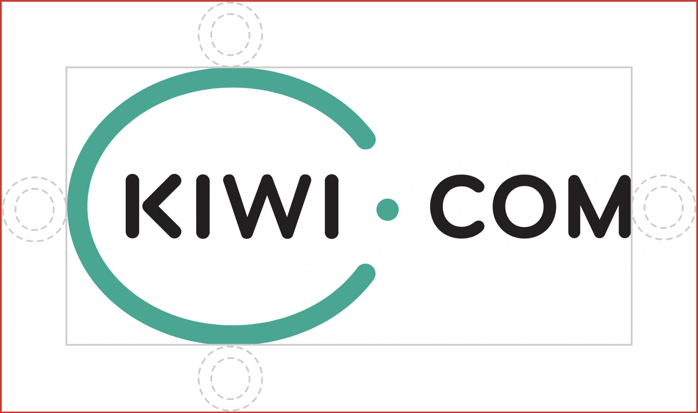

## Logo

### Basic logo

This is the preferred application on a light background.

<FancyLink
  title="Download the full basic logo as .png"
  href="/brand/logo.png"
  icon="download"
  download
/>

<FancyLink
  title="Download the full basic logo as .pdf"
  href="/brand/logo.pdf"
  icon="download"
  download
/>

<FancyLink
  title="Download the full basic logo as .svg"
  href="/brand/logo.svg"
  icon="download"
  download
/>

<FancyLink
  title="Download the full basic logo as .eps"
  href="/brand/logo.eps"
  icon="download"
  download
/>

### Logo symbol

<FancyLink
  title="Download the logo symbol as .png"
  href="/brand/logo-symbol.png"
  icon="download"
  download
/>

<FancyLink
  title="Download the logo symbol as .pdf"
  href="/brand/logo-symbol.pdf"
  icon="download"
  download
/>

<FancyLink
  title="Download the logo symbol as .svg"
  href="/brand/logo-symbol.svg"
  icon="download"
  download
/>

<FancyLink
  title="Download the logo symbol as .eps"
  href="/brand/logo-symbol.eps"
  icon="download"
  download
/>

### Inverted logo

<FancyLink
  title="Download the inverted logo as .png"
  href="/brand/logo-inverted.png"
  icon="download"
  download
/>

<FancyLink
  title="Download the inverted logo as .pdf"
  href="/brand/logo-inverted.pdf"
  icon="download"
  download
/>

<FancyLink
  title="Download the inverted logo as .svg"
  href="/brand/logo-inverted.svg"
  icon="download"
  download
/>

<FancyLink
  title="Download the inverted logo as .eps"
  href="/brand/logo-inverted.eps"
  icon="download"
  download
/>

### Inverted logo symbol

<FancyLink
  title="Download the inverted logo symbol as .png"
  href="/brand/logo-symbol-inverted.png"
  icon="download"
  download
/>

<FancyLink
  title="Download the inverted logo symbol as .pdf"
  href="/brand/logo-symbol-inverted.pdf"
  icon="download"
  download
/>

<FancyLink
  title="Download the inverted logo symbol as .svg"
  href="/brand/logo-symbol-inverted.svg"
  icon="download"
  download
/>

<FancyLink
  title="Download the inverted logo symbol as .eps"
  href="/brand/logo-symbol-inverted.eps"
  icon="download"
  download
/>

### Logo spacing

The logo is designed to be simple and graphically clean. So please, let
it breathe.

### Logo size

Logos used online should be at least 24 pixels high.

The minimum size for the offline use of the Kiwi.com logo is 18 × 9 mm.

<!-- vale Vale.Spelling = NO -->

## Favicons

<FancyLink
  title="Download the Kiwi.com favicons"
  href="/brand/favicons.zip"
  icon="download"
  download
/>

<!-- vale Vale.Spelling = YES -->

## Brand color

These are the basic palette colors.
See [more about using color](/foundation/color/)
including the entire Orbit palette, guidelines on color use,
and how the Orbit [design tokens](/foundation/design-tokens/)
enable synchronization of any color changes.

### Product color

<Palette colors={["paletteProductNormal", "paletteProductDark"]} />

### Cloud

<Palette colors={["paletteCloudNormal", "paletteCloudDark"]} />

### Ink

<Palette colors={["paletteInkLight", "paletteInkNormal"]} />

### Green

<Palette colors={["paletteGreenNormal"]} />

### Red

<Palette colors={["paletteRedNormal"]} />

### Orange

<Palette colors={["paletteOrangeNormal"]} />

### Blue

<Palette colors={["paletteBlueNormal"]} />

### Offline usage

Do you need a color for a marketing booth? Or stickers?

The best way to ensure alignment with the Kiwi.com brand color in print assets
is to use Pantone or CMYK.

| Color type    | Value                             |
| ------------- | --------------------------------- |
| Pantone color | **Pantone 3275**                  |
| RAL color     | **RAL 170 60 40** (Persian green) |
| CMYK color    | **CMYK(93,0,57,0)**               |

Remember to maintain at least the [minimum logo size](#logo-size).

## Typography

See our [basic guidelines for typography](/foundation/typography/).
