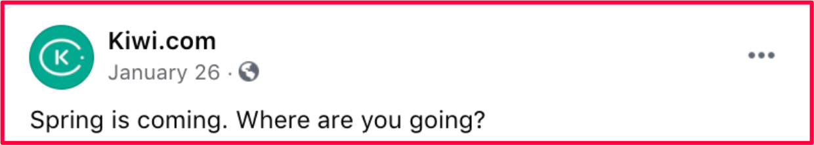
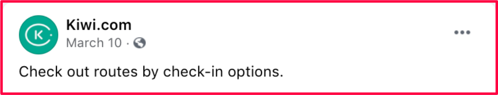

[broken link](https://collier.cz/this-is-broken)

Through the way we speak,
we want to ignite people's passion to travel and tap into their thirst for discovery.
Whatever the message on social media,
whether it's inspirational, supportive, or reactive,
we want to inspire them to adventure further in the knowledge that Kiwi.com will get them there.
We need to convey a new approach to traveling for a new world and get our customers to

> **SEE THE WORLD DIFFERENTLY.**

See how this works with our [core principles](/kiwi-use/content/voice-and-tone/).

## Passionate

> We're in awe of the world around us

We love what we do so we write with feeling because we share in our customers' excitement.
Writing to inspire and bring out their adventurous side.
Life is about living and our copy should reflect that.
We are about **_can_** and **_should_**---make them feel like they want to go and pack their bags.

## **Empathetic**

> We're a part of the adventure

We're caring and understanding,
we're here to support and give our customers the best travel experience.
We always keep it simple and don't use technical jargon or formalities.
We use contractions like **_we're_**, **_it's_**, **_you're,_**
because they're less formal and functional.

## Inclusive

> We invite everyone to join

As a global brand, we need to include everyone.
We use diverse people in our imagery and universal language rather than slang or idioms.
So, no one is left out.
We write to make customers feel part of the conversation, regardless of their cultural background.

## Straightforward

> We make life simple

We're always simplifying.
Don't use 5 words where 2 will do.
We don't speak in a corporate way, but we're always professional.
We're to the point -- clear and concise with our actions.

## Transparent

> We're real and open

We're always authentic with our messaging.
We recognize travel can have both ups and downs.
We use conversational and clear language to make our point.

## Examples

### Spring

<!-- eslint-disable-next-line mdx/remark, prettier/prettier -->
#### Be less...

<!-- prettier-ignore-start -->
<!-- eslint-disable-next-line -->
#### Be more...
<!-- prettier-ignore-end -->

### Restrictions

<!-- prettier-ignore-start -->
<!-- eslint-disable-next-line -->
#### Be less...
<!-- prettier-ignore-end -->

<!-- prettier-ignore-start -->
<!-- eslint-disable-next-line -->
#### Be more...
<!-- prettier-ignore-end -->

### Stopovers

<!-- prettier-ignore-start -->
<!-- eslint-disable-next-line -->
#### Be less...
<!-- prettier-ignore-end -->

<!-- prettier-ignore-start -->
<!-- eslint-disable-next-line -->
#### Be more...
<!-- prettier-ignore-end -->

### Behind the scenes

<!-- prettier-ignore-start -->
<!-- eslint-disable-next-line -->
#### Be less...
<!-- prettier-ignore-end -->

<!-- prettier-ignore-start -->
<!-- eslint-disable-next-line -->
#### Be more...
<!-- prettier-ignore-end -->

### Options

<!-- prettier-ignore-start -->
<!-- eslint-disable-next-line -->
#### Be less...
<!-- prettier-ignore-end -->

<!-- prettier-ignore-start -->
<!-- eslint-disable-next-line -->
#### Be more...
<!-- prettier-ignore-end -->

### At the airport

<!-- prettier-ignore-start -->
<!-- eslint-disable-next-line -->
#### Be less...
<!-- prettier-ignore-end -->

<!-- prettier-ignore-start -->
<!-- eslint-disable-next-line -->
#### Be more...
<!-- prettier-ignore-end -->

## In short: Guiding principles

1.  **Always professional**:
    we know what we are doing, and our credibility comes naturally
2.  **Globally inclusive**:
    we include different cultures
    and avoid issues that could be lost in translation
3.  **Service first**:
    we're about solutions, not problems,
    although we know things can go wrong as well as right.
    Our focus is customers and their experience,
    not just our product features
4.  **Add variety**:
    we use this guide as a framework to tailor each post or contact,
    we don't robotically copy and paste our social media responses
5.  **Keep it simple**:
    we don't overcomplicate
    or use jargon, or technical terms the customer doesn't know
