import { Grid } from "@kiwicom/orbit-components";

import ImageInGrid from "./ImageInGrid";

> As the old Czech proverb goes: "Don't just say it, show it!"

The right imagery makes our content much more powerful and engaging.
It also helps us to differentiate from our competitors.

Our photography should always have a sense of optimism.
The subjects and environments should feel authentic.
We shouldn't be afraid of showing **real faces and emotions.**
People should be **unposed** and their **composition** within the environment **natural**.
Lighting, color, and tone should be **unfiltered and realistic \#NoFilter!**

Each image should establish an emotional connection with our audience,
showing them the world Kiwi.com can offer.

<!-- eslint-disable -->

## Our destinations...

<!-- eslint-enable -->

**are** real, authentic, and full of wanderlust.
Images don't just show the place but the _details_ of the people and the story.

<Grid columns="200px 200px 296px;" rows="minmax(100px, auto) minmax(100px, auto);" gap="10px;">

<ImageInGrid column="1 / 3" row="1">

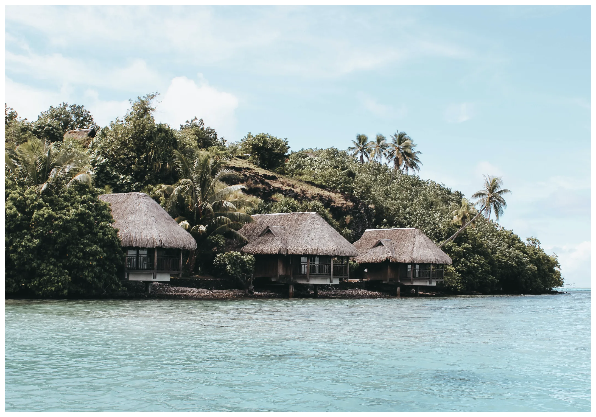

</ImageInGrid>

<ImageInGrid column="3 / 3" row="1 / 3">

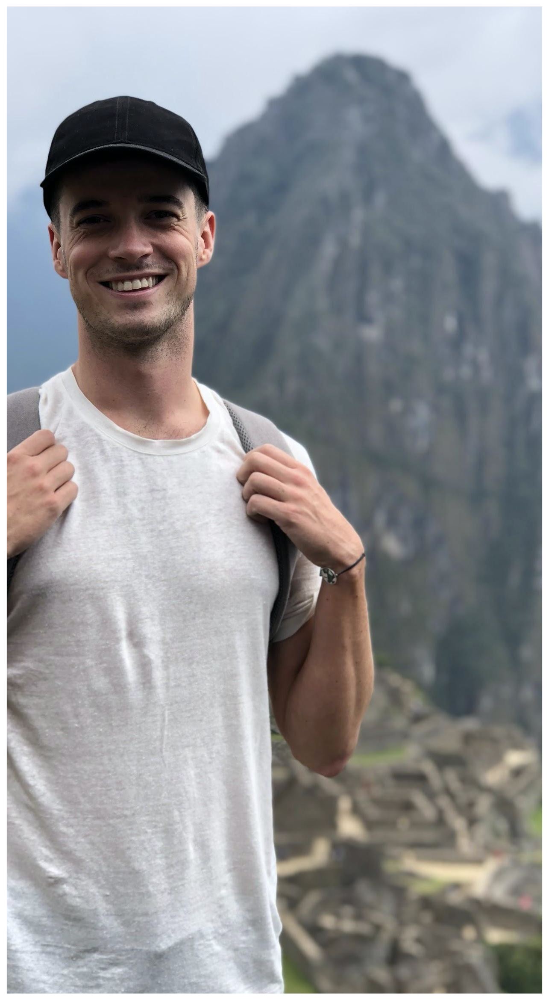

</ImageInGrid>

<ImageInGrid column="1" row="2">

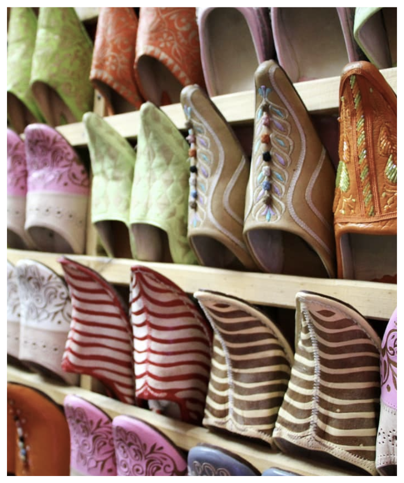

</ImageInGrid>

<ImageInGrid column="2" row="2">

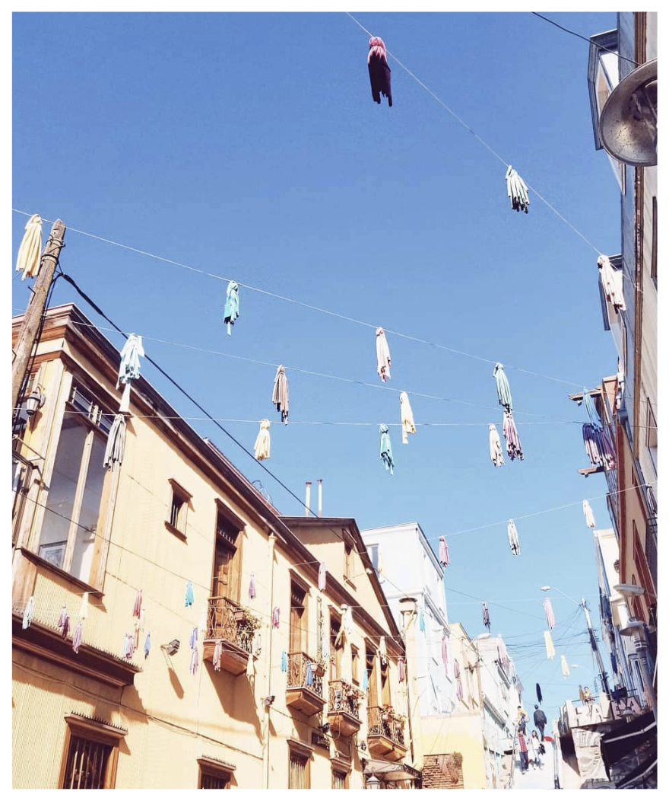

</ImageInGrid>

</Grid>

**aren't** unrealistic, over edited, broad stock landscapes that lack emotion.

<Grid columns="360px 360px;" gap="10px;" rows="minmax(100px, auto) minmax(100px, auto);">

<ImageInGrid column="1 / 3" row="1">

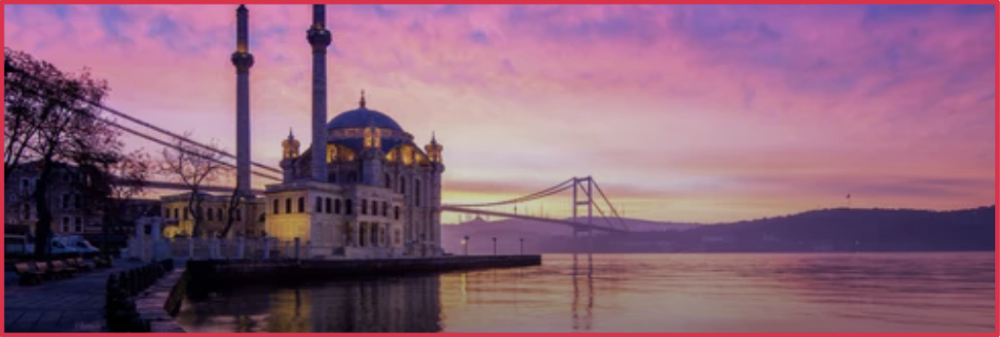

</ImageInGrid>

<ImageInGrid column="1" row="2">

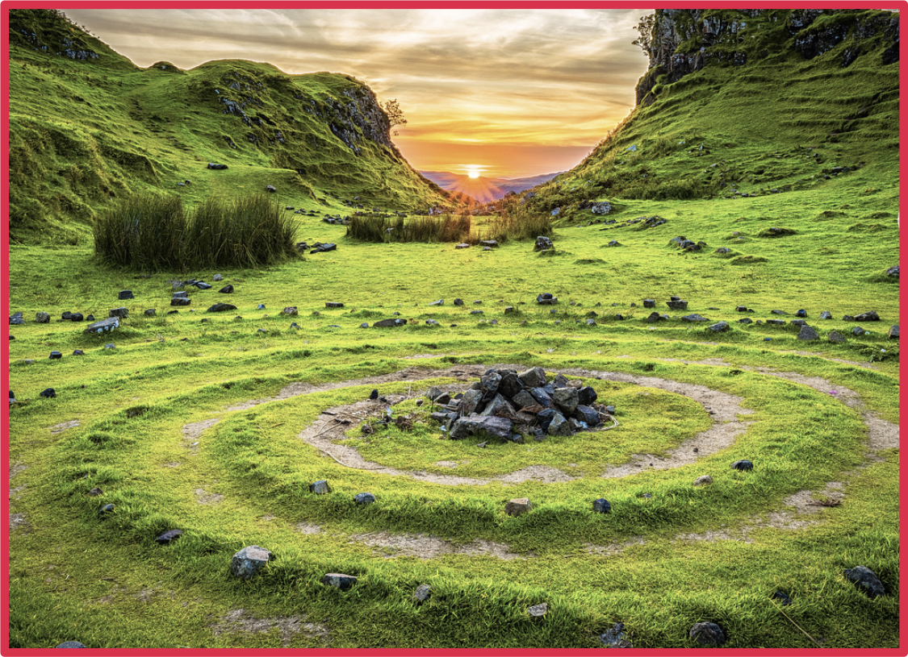

</ImageInGrid>

<ImageInGrid column="2" row="2">

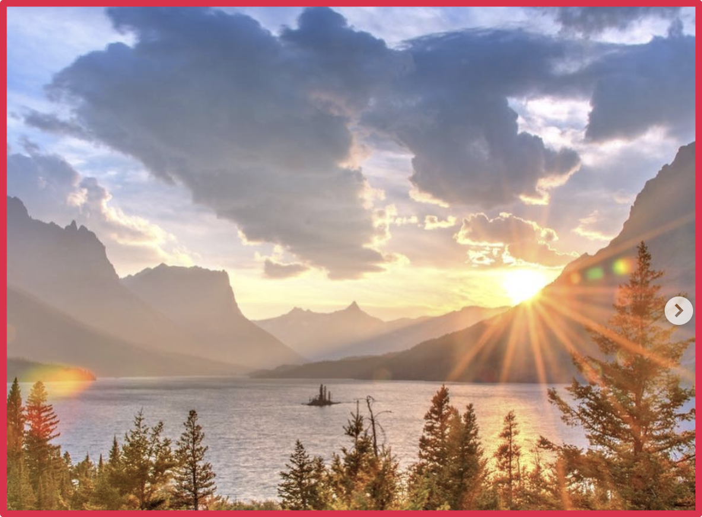

</ImageInGrid>

</Grid>

<!-- eslint-disable -->

## Our people...

<!-- eslint-enable -->

**are** diverse and show real authentic moments.
They're natural, capturing the emotions and adventurous spirit of our audience.

<Grid columns="360px 360px;" gap="10px;" rows="minmax(100px, auto) minmax(100px, auto);">

<ImageInGrid column="1 / 3" row="1">

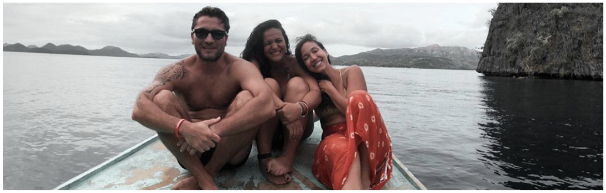

</ImageInGrid>

<ImageInGrid column="1" row="2">

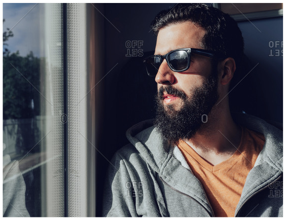

</ImageInGrid>

<ImageInGrid column="2" row="2">

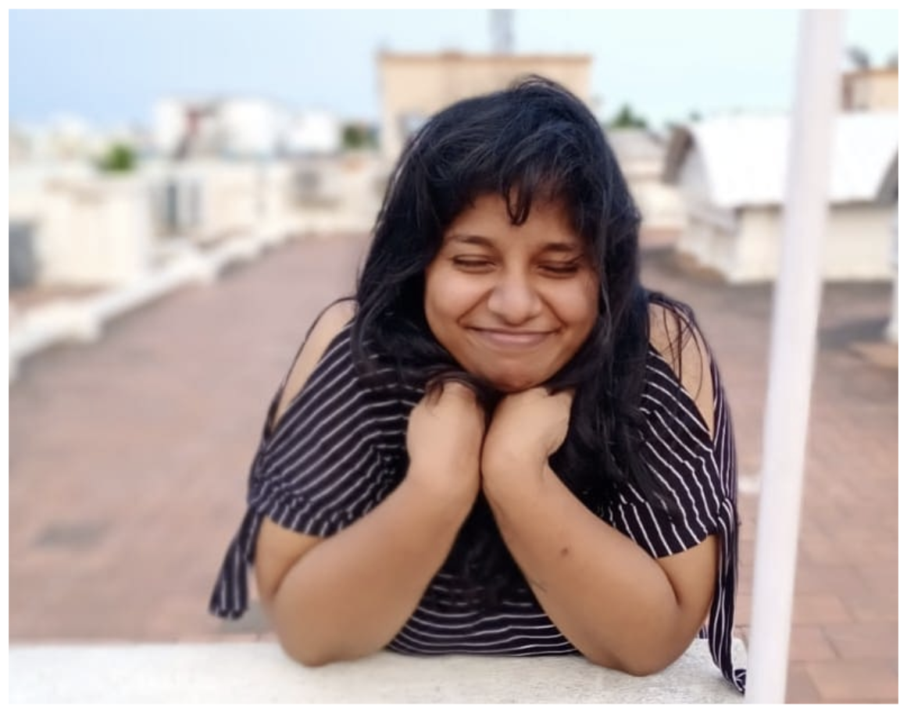

</ImageInGrid>

</Grid>

**aren't** posed, facing away from the camera or recreating unrealistic and cliched moments.

<Grid columns="420px 276px;" gap="10px;" rows="minmax(100px, auto) minmax(100px, auto);">

<ImageInGrid column="1" row="1">

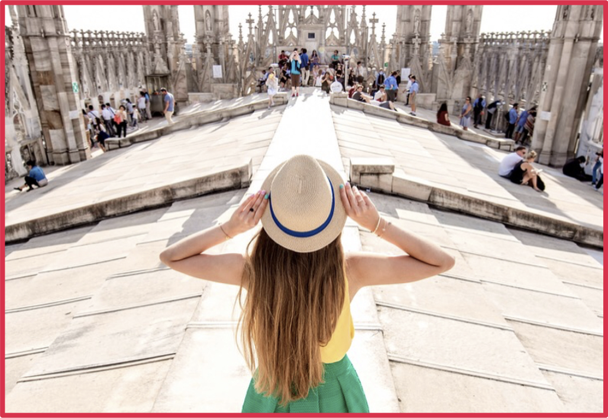

</ImageInGrid>

<ImageInGrid column="2" row="1 / 3">

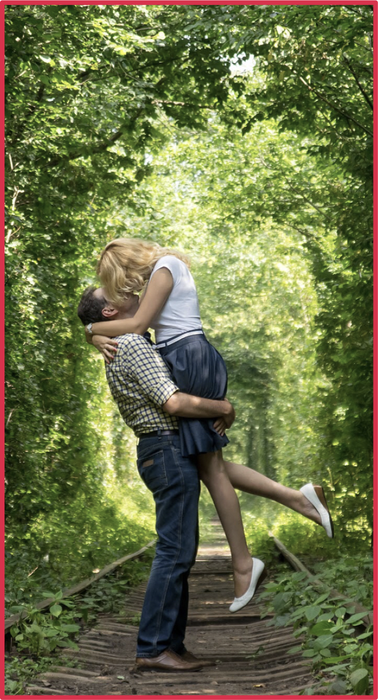

</ImageInGrid>

<ImageInGrid column="1" row="2">

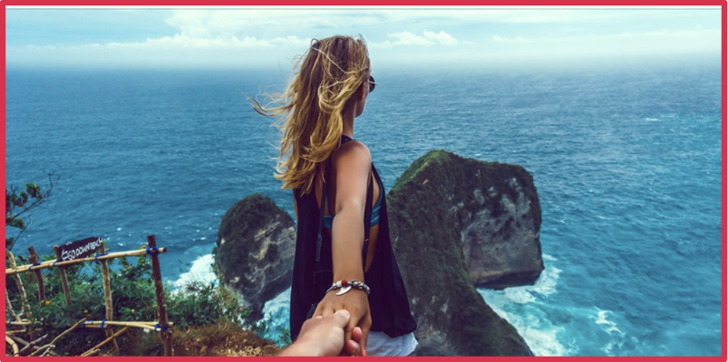

</ImageInGrid>

</Grid>

<!-- eslint-disable -->

## Our travel...

<!-- eslint-enable -->

**is** bright and cheerful.
It's packing and getting ready.
The journey isn't a boring transition, it's all part of the adventure.

<Grid columns="260px 300px;" gap="10px;" rows="170px 10px 200px;">

<ImageInGrid column="1" row="1">

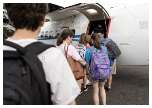

</ImageInGrid>

<ImageInGrid column="2" row="1">

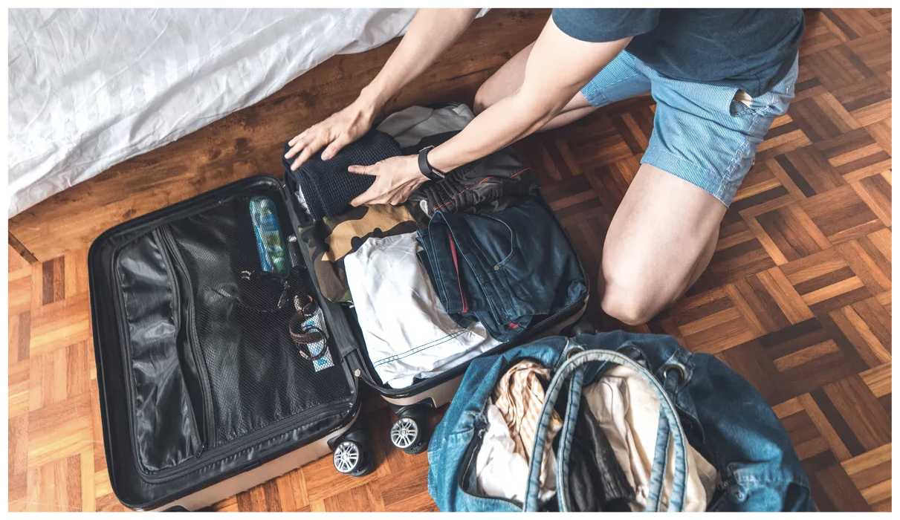

</ImageInGrid>

<ImageInGrid column="1" row="3">

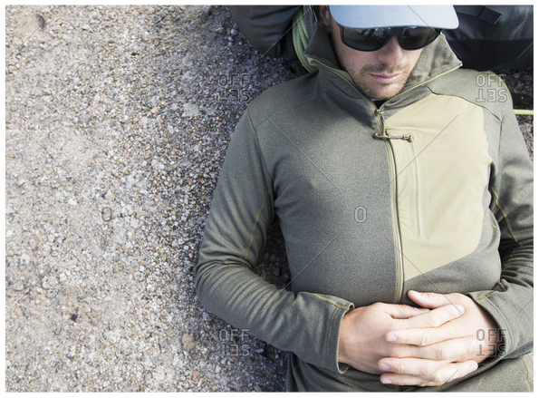

</ImageInGrid>

<ImageInGrid column="2" row="2">

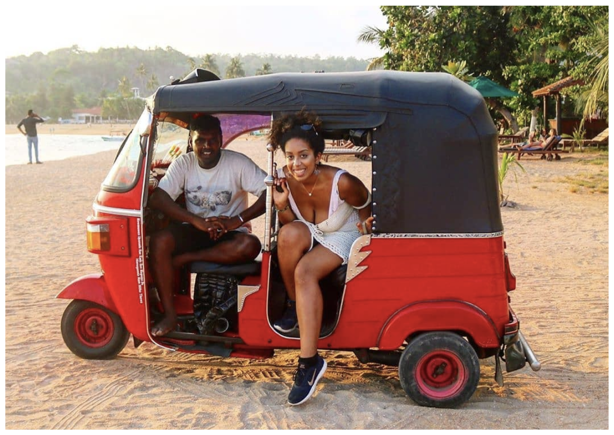

</ImageInGrid>

</Grid>

**isn't** dull and boring, it's not posed cliched moments
or suggestive or monotony/complexity/delays.

<Grid columns="430px 290px;" gap="10px;" rows=" minmax(100px, auto);">

<ImageInGrid column="1 / 3" row="1">

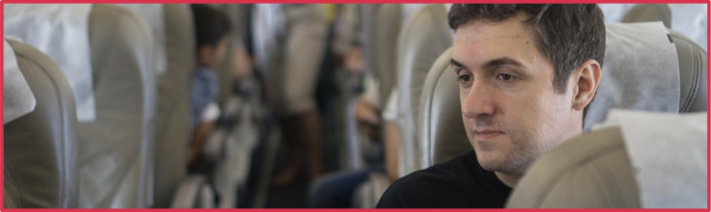

</ImageInGrid>

<ImageInGrid column="1" row="2">

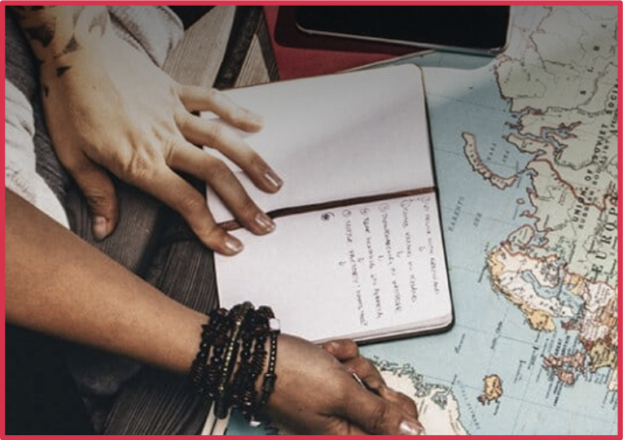

</ImageInGrid>

<ImageInGrid column="2" row="2">

</ImageInGrid>

</Grid>

<!-- eslint-disable -->

## Our moving images...

<!-- eslint-enable -->

**are** authentic and help create awe in the world around you to tell a more engaging story.

<Grid columns="210px 210px;" gap="10px;" rows=" minmax(100px, auto);">

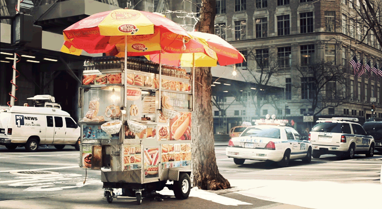

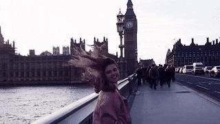

</Grid>

**aren't** stylized, tongue-in-cheek or over-produced,
or trying to represent unreal situations.

<Grid columns="202px 202px;" gap="10px;" rows=" minmax(100px, auto);">

</Grid>
