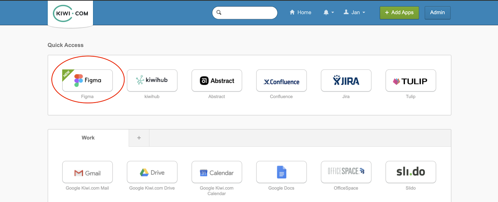
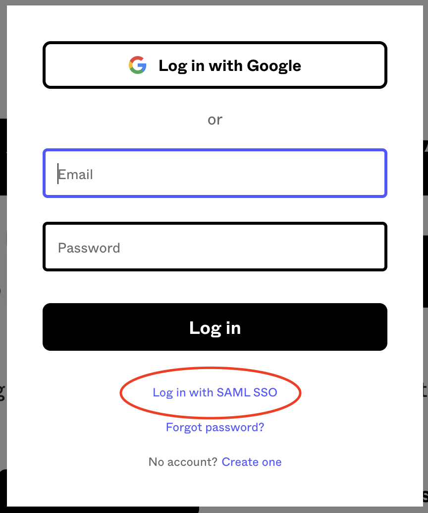
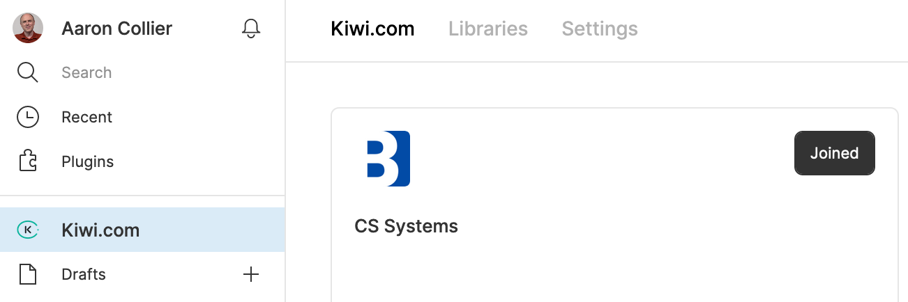

<Callout>

This guide is for [Kiwi.com](https://www.kiwi.com/) employees.
For everyone else, we offer an [open-source guide](/getting-started/for-designers/open-source/).

</Callout>

**Figma is where all of our design can happen collaboratively in one place.**
Instead of different tools in different domains,
everyone can take advantage of a unified process to focus on creating the best experiences.

All of it is focused on the principle of designing **first for** [**native mobile** implementations](https://www.figma.com/file/PWGp3tANcQDVGI1W12swfn/Mobile-Experience-Guidelines?node-id=0%3A1).
From this seed, all of the other designs will grow.

We've broken the process down into various parts so you can focus on what you need to know.
Get started by logging into Figma and finding your team.

If you run into any issues,
the slack channel \#plz-figma is your one-stop answer shop.

## **Logging in**

To get going, log into Figma using Okta.
The easiest way is to click the Figma logo from the Okta dashboard.

If you don't see the logo,
you can request access in [\#plz-access](https://skypicker.slack.com/archives/C2751M4TZ)
and tag **\@will**.

You can also log in directly with Figma.

1.  Go to [figma.com](https://www.figma.com/).
2.  Click **Log in** at the top of the page.
3.  Choose **Log in with SAML SSO**.
4.  Enter your Kiwi.com address and click **Log in**.
5.  Enter your Okta details as necessary.

Now you're inside the Kiwi.com organization.
Anyone with a Kiwi.com email address is automatically a member of the organization
and can view all designs.
Now you need to find the designs relevant to you.

## **Joining teams**

If you've never logged into Figma before,
you'll find an overview of the teams available to you
within the [Kiwi.com organization](/kiwi-use/guides/working-with-figma/structure/#organization).

Teams are the top-level organizational unit within Figma
and are created based on domains, such as the Kiwi.com App and Web teams.
Anyone with a Kiwi.com email address can join any team they like
and **view and** [**comment on all designs within it**](/kiwi-use/guides/working-with-figma/collaboration/#commenting-on-designs).
So join the teams with designs you're interested in.

### **Why are our app and website split into two teams?**

At first glance, it might seem confusing that we've split the Kiwi.com organization
into separate teams for mobile app and website designs.
And why are designs for the app separate from
our responsive designs for viewing the website on mobile devices?

- **Native design is specific**
  Designing for the app requires a different approach
  (read more in our [Mobile Experience Guidelines](https://www.figma.com/file/PWGp3tANcQDVGI1W12swfn/Mobile-Experience-Guidelines?node-id=3%3A30)).
  Having a separate team for the app allows designers to focus on the needs of our app users.
- **Promoting an app-first approach**
  The app should be the initial focus of our design work.
  All designs should start out working for small screens.
  The base viewport for all designs should be **360×640**
  (see the [Mobile Experience Guidelines](https://www.figma.com/file/PWGp3tANcQDVGI1W12swfn/Mobile-Experience-Guidelines?node-id=3%3A30) for more on why).

  Once everything works there,
  it can be adjusted to work for responsive needs
  and even scaled up to work also on the largest desktop screens.
  But the focus should always be on first optimizing the native mobile design.

- **Saving time**
  When designing for the website, it's usually enough to mostly design responsive flows.
  Then, you can add a couple of screens to cover cases for larger screens.
  Forcing designers to design separately for smaller and larger website screens
  would unnecessarily slow them down.

  Also, the separate teams for the app and website mean
  we only have to load the relevant components.
  This will ensure the files load quickly and you can get to work on the relevant designs.

#### **Linking designs**

To facilitate navigating between app and website designs,
we've created a [Link component](https://www.figma.com/file/Mutou0a3WLf4bZrApWVRU9Kz/Helpers?node-id=73268%3A61)
in the Helpers library, which is automatically included in each team.
That way, you can add a link to any other versions of the design to make them easy to compare.
