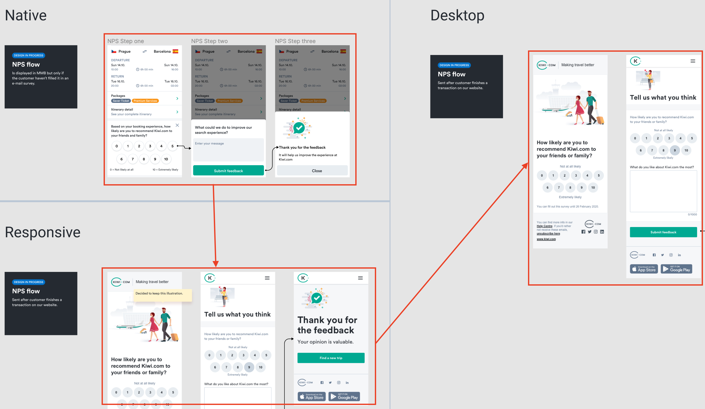
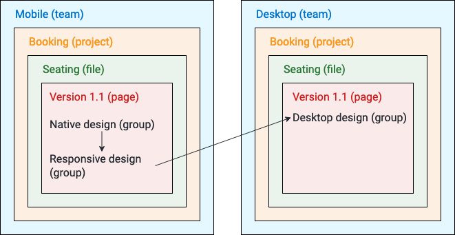

All our designs in Figma should start with their native mobile implementations,
which should follow the [guidelines for native experiences](https://www.figma.com/file/PWGp3tANcQDVGI1W12swfn/Mobile-Experience-Guidelines?node-id=0%3A1).
Each designer should be responsible for a single feature and its entire design from mobile to desktop.

This means the first explorations and ideas come within the mobile team
and continue until they're ready.
Ideally, this design should be the same for responsive implementations.
If there are any small differences,
the responsive designs can sit inside the same page as the native design
but in a separate [group](/kiwi-use/guides/working-with-figma/structure/#groups).

Once the designs are ready for smaller screens,
they can be scaled up to fit larger screens on the desktop.
These are placed in a separate team ([read about why](/kiwi-use/guides/working-with-figma/#why-are-mobile-and-desktop-split-into-two-teams))
and the [designs can be linked](/kiwi-use/guides/working-with-figma/#linking-designs)
for easy navigation among them.

## Consistent native mobile designs

It's best to aim for designs to be consistent across platforms.
But it's important to remember that sometimes different platforms
have different approaches that need to be taken into account.
For this, it's best to try to create platform-agnostic designs
that can then be applied to different platforms.

### Example: Buttons with different heights

Although Android and iOS can have many similarities (such as the horizontal spacing),
generally speaking they have different heights for elements like buttons, inputs, and toolbars.
Generally, buttons are 44 pts high in iOS and 48 pts in Android.

So in Figma, instead of having buttons overly optimized for one platform or the other,
button components in Figma are 46 pts high.
This isn't a value that is actually be used,
but it allows designers to make their designs basically fit with each platform.

The recommendation to follow a [4-pixel grid system](/foundation/spacing/) for designs still holds,
but the height of some elements may different from this slightly.
Remember to use your best judgement in designing specific instances.
