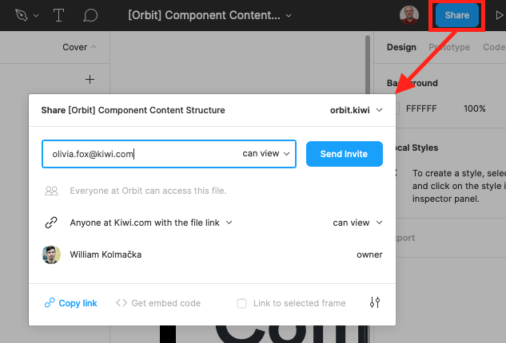

To get the most out of your designs and have them ready faster,
get your whole team involved early in the process.
Gathering feedback at the start of your design work can save you from costly refactoring later.

Figma enables real-time collaboration so you can work together from anywhere.
Remember that before you invite people to your project,
you should [structure your designs](/kiwi-use/guides/working-with-figma/structure/)
so they know what they're collaborating on.

## **Sharing your designs**

All teams are open to everyone with a kiwi.com email address,
so anyone at Kiwi.com can view and comment on your designs.
To make sure the right people see a specific design:

1.  Click **Share** in the top right.
2.  Enter a person's name to find them within the organization
    or email to invite external reviewers.
3.  Unless you're inviting another designer/writer,
    leave the permissions as **can view** (which includes the ability to comment).

    - Every person with editing permissions costs money,
      so please don't give editing permissions unless it's necessary.

4.  Send an invitation to notify them by email.
5.  Repeat for everyone you want to invite.

You can also use the **Share** button to copy a link to paste in Slack or elsewhere.

## **Commenting on designs**

Comments in Figma can be connected directly to individual parts of the design.
They're also listed in sequence, so you can always find the most recent ideas,
and let you @ others in the team to notify them directly.

To get started commenting,
press the C key or click the **Add/Show Comments** button (a speech bubble) in the top left.

A list of comments appears on the right, with the most recent at the top.
If you've visited the file before and have unread comments,
the **Add/Show Comments** button and the comments in the list are highlighted with a red icon.

To add new comments, click next to what your comment relates to and add your message.

## Sending for review

When you have something you'd like other people to take a look at,
get it ready for review.
Whether you're sending a whole [page](/kiwi-use/guides/working-with-figma/structure/#pages)
for review or just a [group](/kiwi-use/guides/working-with-figma/structure/#groups),
use the relevant helper ([Header](https://www.figma.com/file/Mutou0a3WLf4bZrApWVRU9Kz/Helpers?node-id=74020%3A79)
for pages and [Group cover](https://www.figma.com/file/Mutou0a3WLf4bZrApWVRU9Kz/Helpers?node-id=73553%3A11)
for groups) to set the status to for review.
Note that you can set different statuses for the design and the copy.

If you want to get specific people involved in the review,
[add a comment](#commenting-on-designs) and tag them in it.
This ensures they get a notification that there's something for them to see.

When all comments have been resolved,
you can change the status to Ready for development
and [hand it off](/kiwi-use/guides/working-with-figma/handoff/#sending-designs-to-development).
