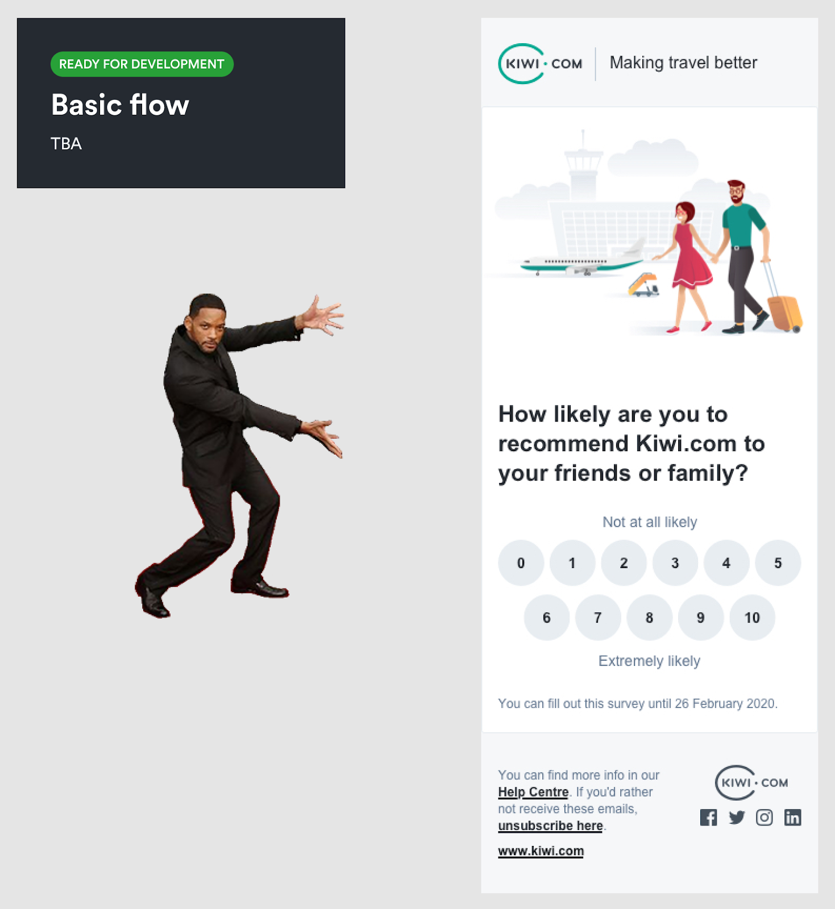
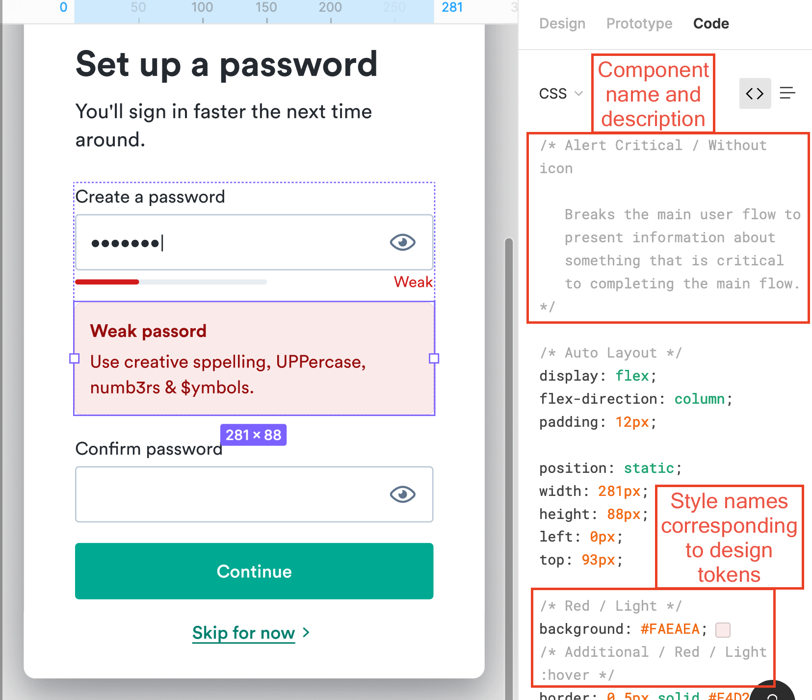
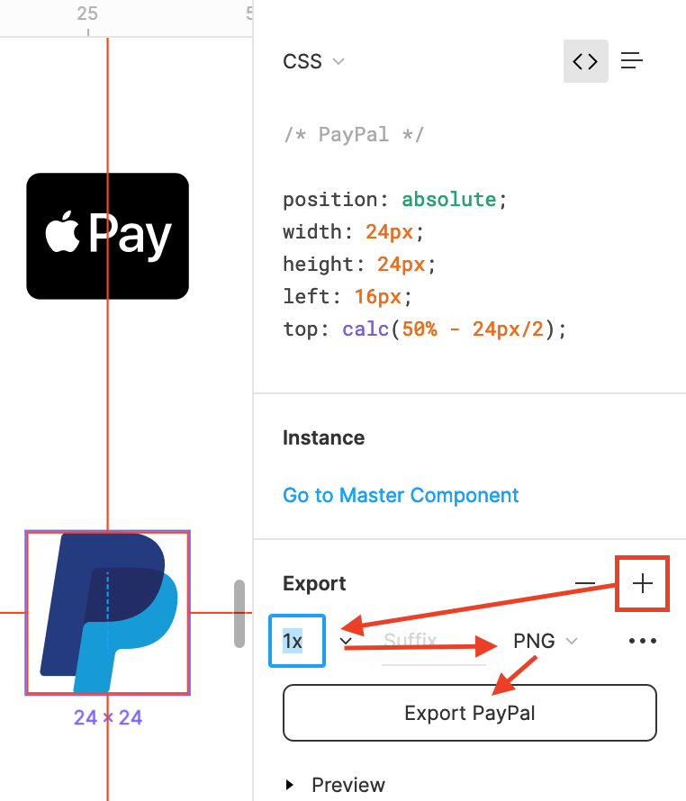

## **👩‍🎨** **Sending designs to development **

The first thing to remember is that you don't have to wait
until your designs are pixel perfect to get developers involved.
Start the [collaboration process](/kiwi-use/guides/working-with-figma/collaboration/)
early to save time later.

You can also prepare a specific design by adding a [Willy component](https://www.figma.com/file/Mutou0a3WLf4bZrApWVRU9Kz/Helpers?node-id=43215%3A13)
from the Helpers library, which is automatically included in each team.
This helps you point to designs that need attention.

Then choose who you want to hand off to and [share your designs](/kiwi-use/guides/working-with-figma/collaboration/#sharing-your-designs).
If they're unfamiliar with Figma, help them learn how to work with it,
such as by sharing the next section of this page with them.

## **👨‍💻** **Developing based on designs**

The first thing to remember is that the designs you're looking at might not be finalized yet.
Designers share works in progress with you because they value your feedback in shaping the design.
So pay attention to the structure of the designs to see where they are in the process.
See especially [how handoff pages are structured](/kiwi-use/guides/working-with-figma/structure/#handoff).

If you're looking to see the specific parameters of the design,
find them in the **Code** tab on the right
(automatically selected if you only have view/comment permissions).

The code can be displayed for CSS, iOS, and Android.
These can be used as guidelines when developing your own implementations.

If you select components, their names and descriptions appear as code comments.
Similarly, the names of selected styles appear as comments,
which can help you determine which [design tokens](/foundation/design-tokens/) to use.

### Exporting images

If a design has an image in it that you need for development, export it in the format you need.
You'll find options for size and format on the
Code tab after clicking the **+** next to **Export**.

### Copying text

By default, everyone who can view a file can copy text from it.
To select text, select the given layer that contains the text
(dragging your cursor doesn't work).
Then you can copy text as normal (⌘+C, Ctrl+C).
You can also open the context menu and select **Copy/Paste** → **Copy as Text**.

If you find that you can copy text, the file owner has probably turned off the option.
Contact them and ask them to [turn it back on](https://help.figma.com/hc/en-us/articles/360040045574-Restrict-who-can-copy-and-share-files).
