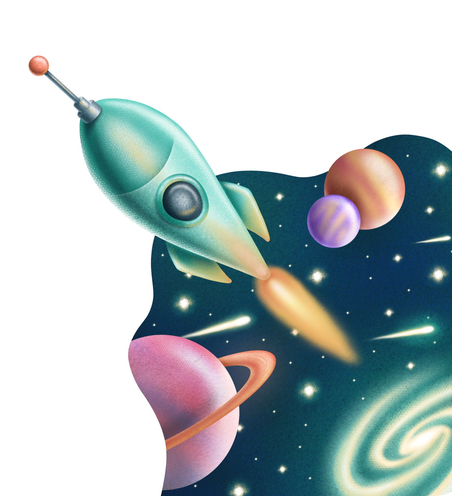
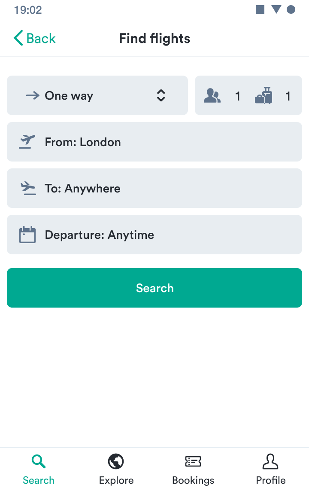
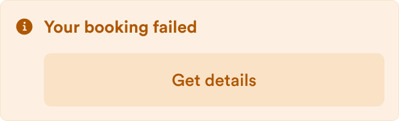
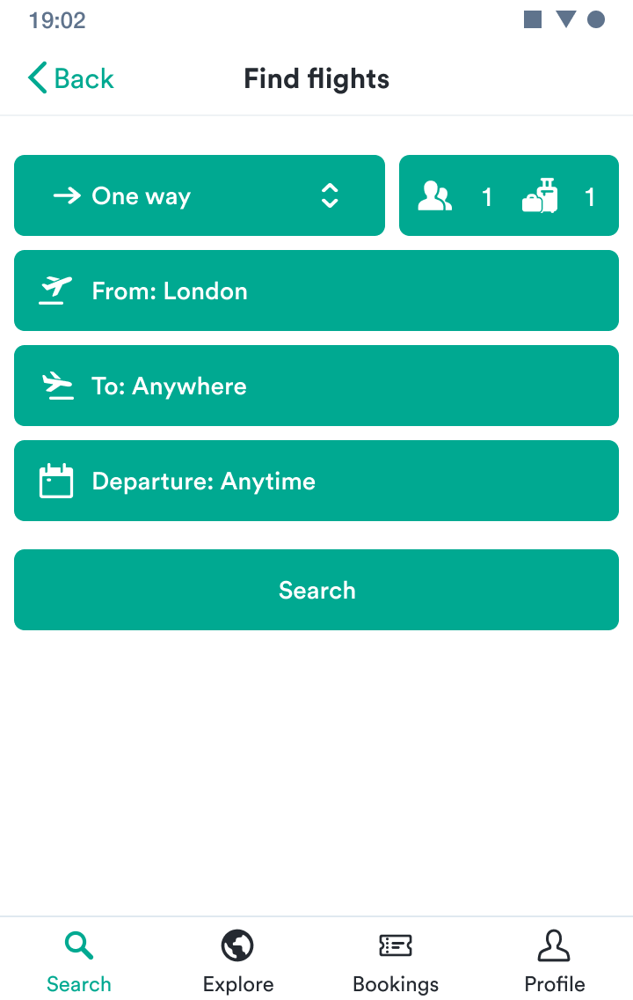

import { Meal } from "@kiwicom/orbit-components/icons";

import useMdxPageTableofContents from "../hooks/useMdxPageTableofContents";
import DocLayout from "../components/DocLayout";
import Palette from "../components/Palette";

<!-- vale off -->

export default ({ children, location }) => {
  const tableOfContents = useMdxPageTableofContents("mdx-examples");
  return (
    <DocLayout
      description="Examples of our components shared across MDX docs files."
      title="MDX examples"
      location={location}
      path="mdx-examples"
      tableOfContents={tableOfContents}
    >
      {children}
    </DocLayout>
  );
};

<!-- vale on -->

This page includes examples of all components shared across our docs files.
See them all in action in the built page
or view the source to see how use them.

## h2 Heading

Text under a second-level heading.

### h3 Heading

Text under a third-level heading.

#### h4 Heading

Text under a fourth-level heading.

##### h5 Heading

Text under a fifth-level heading.

###### h6 Heading

Text under a sixth-level heading.

## Horizontal Rules

---

## Typographic replacements

&copy; &reg; &trade; &para; &sect; &plusmn;

&rarr; &larr;

Ellipses: test.. test... test..... test?..... test!....

Dashes: -- ---

Quotes: "Smartypants, double quotes" and 'single quotes'

## Emphasis

This is **bold text**

This is _italic text_

~~Strike through~~

## Lists

### Unordered

- Create a list by starting a line with `-`.
- Sub-lists are made by indenting 2 spaces:
  - Keep going, just with the indentation the same for each list:
    - Next item
    - And another
    - And another
- Very easy!

### Ordered

1. The first item in the top-level list
2. The second item in the top-level list

   1. The first item in a nested list
   2. The second item in a nested list

3. The third item in the top-level list

### Items with multiple paragraphs

- The first paragraph.

  The second paragraph.

- Another item.

## Code

Inline `code`

Code blocks

```txt
Sample text here...
```

Syntax highlighting

```javascript
const foo = bar => ++bar;

console.log(foo(5));
```

## Callouts

You can use various callouts using properties from [our Alert component](/components/information/alert/react/#props).

<Callout title="This is an informational callout.">

It should present additional useful information.

</Callout>

<Callout type="success" title="This is a success callout.">

You can present tips for additional success or mark progress through a guide.

</Callout>

<Callout type="warning" title="This is a warning callout.">

It can warn about potential dangers that might come with specific choices.

</Callout>

<Callout type="critical" title="This is a critical callout." >

It should only present information that could end up destroying previous progress/data.

</Callout>

<Callout title="This is a callout with only a title" />

<Callout
  title="This is a callout with only a title and a custom icon"
  icon={<Meal ariaLabel="Hot food." />}
/>

## Tables

| Package                        | Description                                                |
| ------------------------------ | ---------------------------------------------------------- |
| orbit-components               | All our React components along with API documentation.     |
| orbit-design-tokens            | All visual UI attributes available as tokens.              |
| eslint-plugin-orbit-components | ESLint rules to enforce best practices for our components. |

### Aligned columns

In addition to the default of left alignment, columns can also be right or center aligned.
Set alignment with colons in the header row.

|                         Option |                        Description                         |
| -----------------------------: | :--------------------------------------------------------: |
|               orbit-components |   All our React components along with API documentation.   |
|            orbit-design-tokens |       All visual UI attributes available as tokens.        |
| eslint-plugin-orbit-components | ESLint rules to enforce best practices for our components. |

## Links

External links

[link text](https://github.com/kiwicom/orbit)

Internal links

[link text](.)

Automatically converted link <https://github.com/kiwicom/orbit>

## Images

### Plain Images



### Image with caption


### Images by reference

You can also add images with a footnote-style syntax.

![Alt text][id]

Use a reference at the end of the document to define the URL location.

### Figma image

TODO.

### Image container

#### Alignment

<ImageContainer align="left" size="small">


</ImageContainer>

<ImageContainer align="center" size="small">


</ImageContainer>

<ImageContainer align="right" size="small">


</ImageContainer>

#### Size

##### Small

<ImageContainer size="small">


</ImageContainer>

##### Medium

<ImageContainer size="medium">


</ImageContainer>

##### Large

<ImageContainer>


</ImageContainer>

#### Border

<ImageContainer size="small" border>


</ImageContainer>

## Definition Lists

Orbit
: An open source design system for your next travel project.

Design system
: Components, styles, and patterns to create beautiful consistent designs at scale.

## Fancy links

Tiles that span the text area and show icons the links.

<FancyLink title="Orbit GitHub repo" href="https://github.com/kiwicom/orbit/" icon="github" />

Choose from the existing icons or import your own.

<FancyLink title="Eat at Orbit" href="https://orbit.kiwi/" icon={<Meal />} />

## Guidelines

### Guideline do

<Guideline type="do" title="Use secondary small buttons for additional actions on the page">

The secondary small button is great for actions in [cards](/components/structure/card/)
as it stands out from the interface but doesn't take so much attention.

</Guideline>

### Guideline don't

<Guideline type="dont" title="Don’t use Product colors to highlight information">

Because Product colors are used for actions,
it may cause confusion when they're used to highlight some information or text.

</Guideline>

### Guideline with one image

<Guideline type="dont" title="Don't combine with text link">

If you'd like to have an action, consider an [alert](/components/information/alert/)
or a [button](/components/action/button/) instead.


</Guideline>

<Guideline type="do" title="Have one primary action ">

Every screen should have only one button that represents the most important action:
leading the user to the next step.



</Guideline>

### Guideline with only image and title

<Guideline type="dont" title="Don't combine with text link">


</Guideline>

### Guideline with two images

<Guideline type="dont" title="Don't combine with text link">

If you'd like to have an action, consider an [alert](/components/information/alert/)
or a [button](/components/action/button/) instead.




</Guideline>

<Guideline type="do" title="Have one primary action ">

Every screen should have only one button that represents the most important action:
leading the user to the next step.




</Guideline>

### Guideline images with separate descriptions

<GuidelineImages>

<DoImage>


Ensure there's only one primary action on each screen.

</DoImage>

<DontImage>


Don't fill up the screen with primary actions.

</DontImage>

</GuidelineImages>

<GuidelineImages>

<DoImage>


Ensure there's only one primary action on each screen.

</DoImage>

<DontImage>


Don't fill up the screen with primary actions.

</DontImage>

</GuidelineImages>

### Guidelines side by side

<GuidelinesSideBySide>

<Do>

- My profile, My trips, Preferences
- My trips, Upcoming, Completed
- Guidelines, React, iOS, Android

</Do>

<Dont>

- Your user profile, Trips, Settings for your account
- My trips, Trips you have planned, Trips you have taken
- Some general thoughts, Specifics for React, iOS implementation, How it’s done in Android

</Dont>

</GuidelinesSideBySide>

<GuidelinesSideBySide>

<Do>

- As the passenger, it's your responsibility to ensure
  you have the correct visas and travel documents for your trip.

  You should carefully check which countries you're transiting through before making your booking.
  A visa is generally required even for transit or rechecking your baggage.

</Do>

<Dont>

- - As a passenger, it's your responsibility to ensure
    you have the correct visas and travel documents for your trip.
  - You should carefully check which countries you're transiting through before making your booking.
  - A visa is generally required even for transit or rechecking your baggage.

</Dont>

</GuidelinesSideBySide>

## Inline token

TODO.

## Color palette

### Plain palette

<Palette
  colors={[
    "paletteProductLight",
    "paletteProductNormal",
    "paletteProductDark",
    "paletteProductDarker",
  ]}
/>

### Palette with additional shades

<Palette
  allowAdditional
  colors={[
    "paletteProductLight",
    "paletteProductNormal",
    "paletteProductDark",
    "paletteProductDarker",
  ]}
/>

## React examples

<ReactExample exampleId="Wizard-default" />

[id]: ../images/rocket.jpg "Blast into Orbit"
